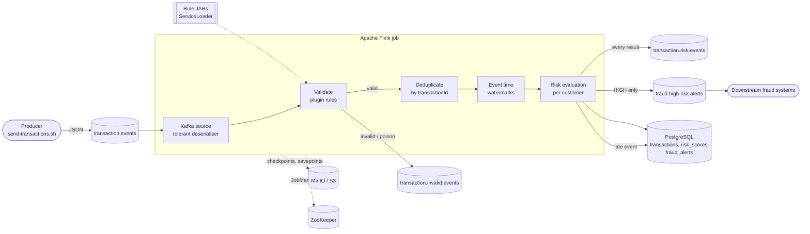
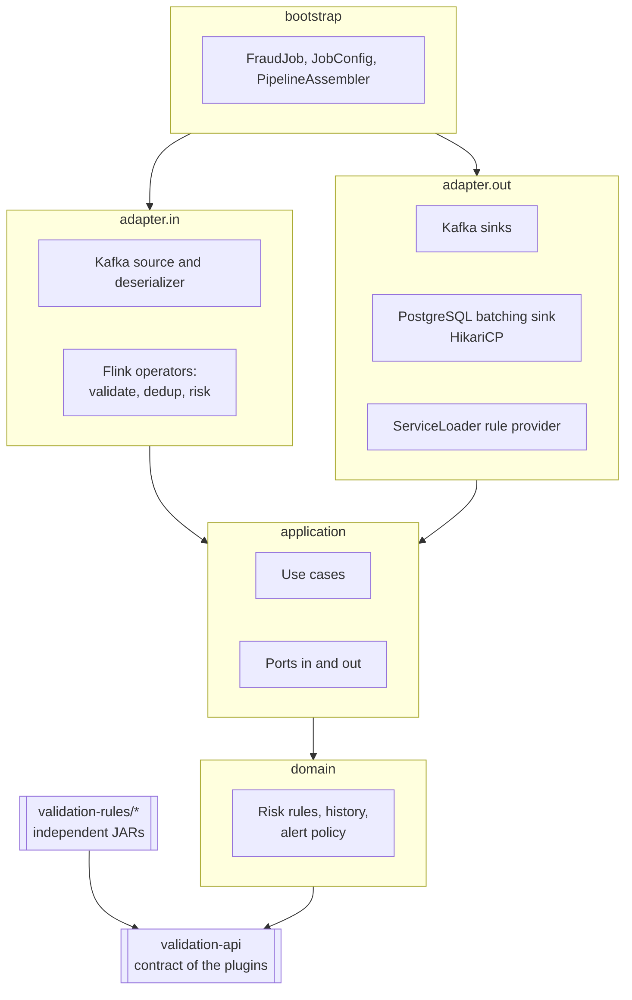
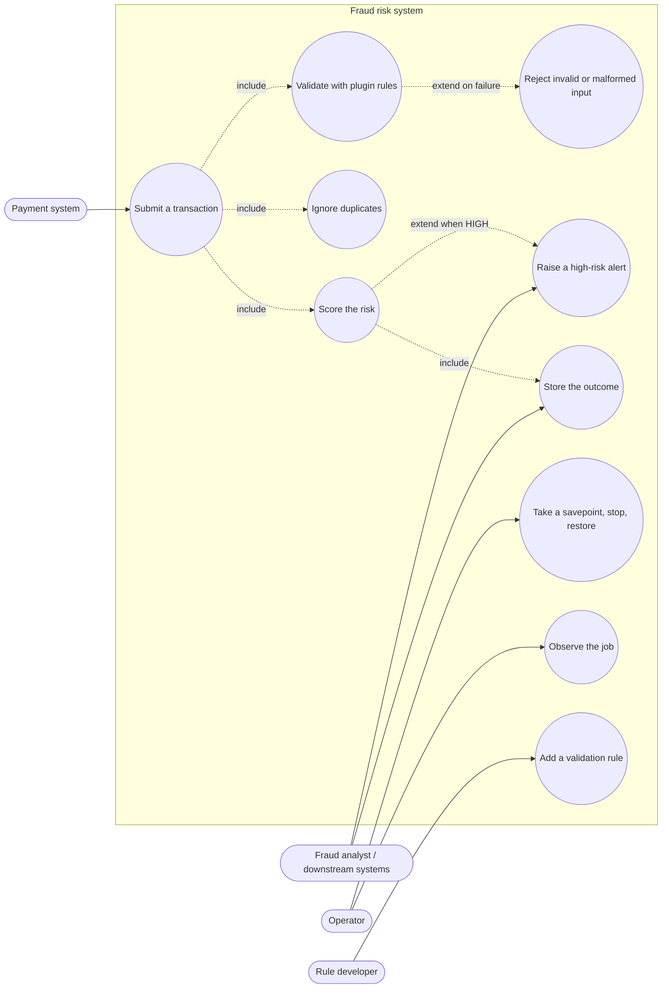
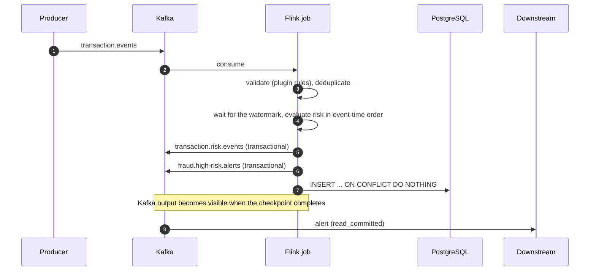

# Transaction fraud/risk POC (Apache Flink 2)

Real-time fraud and risk analysis of payment transactions: **Kafka -> Apache Flink 2.2 -> PostgreSQL and Kafka**.
Validation rules are independent JARs discovered at runtime with `ServiceLoader`; the job itself knows none of them.

## Table of contents

1. [What it does](#what-it-does)
2. [Goals](#goals)
3. [Architecture and use cases](#architecture-and-use-cases)
4. [Prerequisites](#prerequisites)
5. [Build](#build)
6. [Run it locally with Docker Compose (step by step)](#run-it-locally-with-docker-compose-step-by-step)
7. [Run the job as a local application](#run-the-job-as-a-local-application)
8. [Send input events](#send-input-events)
9. [Web UIs and ports](#web-uis-and-ports)
10. [Configuration](#configuration)
11. [Repository layout, tests and further reading](#repository-layout-tests-and-further-reading)

## What it does

Transactions arrive as JSON on a Kafka topic. For each one the job:

1. **validates** it with the plugin rules (minimum amount, supported currency, required fields) and routes invalid or malformed messages to a dead-letter topic;
2. **deduplicates** it by `transactionId`;
3. **scores its risk** in event-time order per customer (transaction velocity, spending velocity, country change, unusual amount);
4. **publishes** the result to Kafka, **stores** it in PostgreSQL and, when the risk is HIGH, publishes an actionable **alert**.

| Topic | Content |
|---|---|
| `transaction.events` | input |
| `transaction.risk.events` | every risk result (LOW, MEDIUM, HIGH) |
| `fraud.high-risk.alerts` | only HIGH-risk alerts, for downstream fraud handling ([details](docs/alerts.md)) |
| `transaction.invalid.events` | invalid and malformed input (dead letters) |

## Goals

This is a proof of concept of how a production-oriented Flink pipeline is built and operated, not only of the business rules:

- event time with watermarks, out-of-order and late events;
- deduplication and idempotent writes;
- plugin architecture: validation rules as separate JARs, with no compile-time reference from the job;
- state and checkpoints on S3 (MinIO), savepoints, restart strategy, JobManager high availability (ZooKeeper);
- failure and recovery behaviour, backpressure towards Kafka;
- clean architecture (ports and adapters) enforced by tests;
- tests at three levels: unit, in-JVM Flink cluster with real Kafka/PostgreSQL containers, scripted scenarios.

**Guarantees, stated honestly.** Kafka output is exactly-once (transactional; consumers must read `read_committed`). PostgreSQL is
**at-least-once with idempotent writes** (`INSERT ... ON CONFLICT DO NOTHING`). The system is **not** end-to-end exactly-once.
Decisions and their reasons are in [docs/decisions](docs/decisions/README.md).

## Architecture and use cases

### Data flow



### Layers (ports and adapters)

Dependencies point inwards only; `ArchitectureTest` fails the build if that is broken.



### Use cases

Mermaid has no UML use-case diagram, so actors and use cases are drawn as a flowchart.



### One HIGH-risk transaction



## Prerequisites

| Tool | Version | Used for |
|---|---|---|
| JDK | 17 or newer (the code targets 17; it is built and tested on JDK 25) | build |
| Maven | 3.9+ | build |
| Docker with Compose v2 | recent | infrastructure, integration tests |
| `python3`, `curl`, `bash` | any | helper scripts |

Free ports: 5432, 8080, 8081, 9000, 9001, 9092 (see [Web UIs and ports](#web-uis-and-ports)).

## Build

```bash
mvn clean verify
```

Runs unit tests and the integration tests (they start Kafka and PostgreSQL with Testcontainers, so Docker must be running; allow a few minutes).

Faster, without the integration tests:

```bash
mvn clean verify -DskipITs
```

What you get:

| Artifact | Path |
|---|---|
| Job (shaded) JAR | `flink-job/target/flink-job-1.0.0-SNAPSHOT-shaded.jar` |
| Plugin API | `validation-api/target/validation-api-1.0.0-SNAPSHOT.jar` |
| Rule JARs | `validation-rules/validation-rule-*/target/*-SNAPSHOT.jar` |

The job JAR deliberately contains **no** rule and not the plugin API; the rules are separate JARs.

## Run it locally with Docker Compose (step by step)

Everything runs in containers: Kafka, PostgreSQL, MinIO (S3), ZooKeeper, the Flink cluster and Kafka UI. Data is kept in `./.data/` (git-ignored).

**1. Build** (see above). Skipping the integration tests is fine here:

```bash
mvn clean verify -DskipITs
```

**2. Copy the JARs to the folders that Compose mounts into the Flink containers:**

```bash
./scripts/stage-dist.sh
```

**3. Start the infrastructure.** The first run builds MinIO from source and pulls images, so it takes a while:

```bash
docker compose up -d
```

**4. Check that it is healthy.** The services `kafka`, `postgres`, `minio`, `zookeeper`, `flink-jobmanager`, `flink-taskmanager` and `kafka-ui` must be `running`; the `*-init` services (topics, schema, bucket) must have **exited with code 0**:

```bash
docker compose ps -a
```

**5. Submit the job to the Flink cluster:**

```bash
./scripts/flink/upload-job.sh
```

It waits for a TaskManager, uploads the JAR and starts it. Open the Flink UI at <http://localhost:8081> and check the job is `RUNNING`.

**6. Send some transactions** (details in [Send input events](#send-input-events)):

```bash
./scripts/send-transactions.sh normal high-risk
```

**7. Look at the results.** They appear after the watermark passes the events and the next checkpoint completes, about 10 to 60 seconds.

Risk results, alerts and invalid events in Kafka (`read_committed` is required for the transactional topics):

```bash
docker compose exec kafka /opt/kafka/bin/kafka-console-consumer.sh --bootstrap-server localhost:19092 \
  --topic transaction.risk.events --from-beginning --isolation-level read_committed --timeout-ms 10000
```

```bash
docker compose exec kafka /opt/kafka/bin/kafka-console-consumer.sh --bootstrap-server localhost:19092 \
  --topic fraud.high-risk.alerts --from-beginning --isolation-level read_committed --timeout-ms 10000
```

```bash
docker compose exec kafka /opt/kafka/bin/kafka-console-consumer.sh --bootstrap-server localhost:19092 \
  --topic transaction.invalid.events --from-beginning --timeout-ms 10000
```

PostgreSQL:

```bash
docker compose exec postgres psql -U fraud -d fraud -c "select transaction_id, status from transactions order by created_at desc limit 10"
docker compose exec postgres psql -U fraud -d fraud -c "select * from fraud_alerts"
```

You can also browse topics in Kafka UI (<http://localhost:8080>) and the checkpoints in the MinIO console (<http://localhost:9001>, bucket `flink-state`).

**8. Operate the job** (all scripts are in `scripts/flink/`):

| Command | What it does |
|---|---|
| `./scripts/flink/list-jobs.sh` | lists jobs and their state |
| `./scripts/flink/savepoint.sh` | takes a savepoint without stopping the job |
| `./scripts/flink/stop-job.sh` | stops with a savepoint and prints its path |
| `./scripts/flink/upload-job.sh --from-savepoint <path>` | starts again from that savepoint |
| `./scripts/flink/cancel-all-jobs.sh` | cancels everything (do this before recreating the Flink containers) |

**9. Stop.**

```bash
docker compose down            # keeps the data in ./.data
rm -rf .data                   # also forgets Kafka, PostgreSQL and MinIO data (stop first)
```

### Application Mode (optional)

The same job run as a dedicated cluster, with the JARs inside `usrlib/` of every container (UI on port 8082). Stop the session job first so the two do not share a consumer group:

```bash
./scripts/flink/cancel-all-jobs.sh
docker compose --profile app-mode up -d flink-jobmanager-app flink-taskmanager-app
```

### Troubleshooting

- **No results.** Results are published when a checkpoint completes (10 s) and only after the watermark passed the events (event time + 30 s). `send-transactions.sh` already sends events that push the watermark.
- **`upload-job.sh` says a job is already running.** Two copies would split the Kafka partitions. Use `list-jobs.sh` or `cancel-all-jobs.sh`.
- **`NoClassDefFoundError` for a validation class, or "no validation rules found".** The rule JARs are copied into Flink when the containers **start**. After changing a rule run `./scripts/stage-dist.sh`, then `docker compose restart flink-jobmanager flink-taskmanager`.
- **A port is taken.** Copy `.env.example` to `.env` and change the ports.

## Run the job as a local application

For debugging in an IDE or without the Flink containers: the job runs as a normal Java process, with Flink's mini cluster inside the JVM, against the Kafka, PostgreSQL and MinIO of Compose. The Flink containers are not needed.

**1. Start only the infrastructure and build:**

```bash
docker compose up -d postgres postgres-init-schema kafka kafka-init
mvn clean install -DskipTests -DskipITs
```

(`install` is needed because the next step resolves the sibling modules from the local Maven repository.)

**2. Run the job.** The classpath of the `integration-tests` module is used because it has the Flink runtime and the real rule JARs; the job module itself keeps both out on purpose.

```bash
mvn -q -pl integration-tests exec:exec -Dexec.executable=java -Dexec.classpathScope=test \
  -Dexec.args="-cp %classpath io.github.jlmc.fraud.bootstrap.FraudJob \
  --kafka.bootstrap-servers localhost:9092 \
  --postgres.url jdbc:postgresql://localhost:5432/fraud \
  --kafka.consumer-group local-app"
```

Every `--key value` is described in [Configuration](#configuration). Without a cluster configuration the job takes a checkpoint every 10 seconds, because its Kafka sinks only commit on checkpoints. Stop it with `Ctrl+C`.

**3. Send events and read the results** exactly as in the Compose section above (steps 6 and 7).

**In IntelliJ IDEA** use the shared run configuration **`FraudJob (local)`** (`.run/FraudJob.run.xml`, it appears in the run
dropdown after the Maven import). Start the infrastructure first (step 1) and press Run or Debug. It is already set up with:

- module `integration-tests`, which has the real rule JARs (runtime scope) and the Flink runtime (provided scope) on its classpath;
- "Include dependencies with 'Provided' scope" enabled, which is what makes the Flink classes available;
- the program arguments for the Compose infrastructure and the consumer group `local-ide`.

**Why the module is `integration-tests` and not `flink-job`.** The run configuration launches the class `FraudJob`, which lives in
`flink-job`; the module in a run configuration only decides the **classpath**, and no test is run. `flink-job` cannot be used for that
on purpose: it must not depend on any validation rule (the build enforces it, so that rules stay independent plugins) and it has
Flink as `provided`. `integration-tests` is the one module that legitimately has the job, the real rule JARs and the Flink runtime
together, so it doubles as the launcher. To make that work its rules have `runtime` scope and its Flink dependencies `provided`
scope (the IDE ignores `test` scope when running a `main`). A dedicated launcher module would be cleaner but is one more module for
what is a developer convenience.

If you create the configuration by hand, the module and that checkbox are the two things that matter: with the `flink-job` module the
job starts but finds no validation rules, and without the checkbox Flink is missing.

Do not run the local application and the cluster job with the same `--kafka.consumer-group` at the same time.

## Send input events

`scripts/send-transactions.sh` publishes ready-made scenarios to `transaction.events` (it needs the Compose stack, `python3` and no other tool).

```bash
./scripts/send-transactions.sh                         # every scenario
./scripts/send-transactions.sh normal high-risk        # chosen scenarios
./scripts/send-transactions.sh --dry-run velocity      # print the messages, send nothing
./scripts/send-transactions.sh --help
```

| Scenario | Sends | Expected result |
|---|---|---|
| `normal` | 1 transaction | risk LOW, score 0 |
| `velocity` | 6 transactions of 1 EUR in 25 s | the 6th: `HIGH_TRANSACTION_VELOCITY` (MEDIUM) |
| `spending` | 3 x 2000 EUR in 40 s | the 3rd: `HIGH_SPENDING_VELOCITY` (MEDIUM) |
| `high-risk` | 6 x 1000 EUR in 25 s | the 6th: score 80, **HIGH**, one alert |
| `country` | PT, then US, then PT within 2 min | the 3rd: `SUSPICIOUS_COUNTRY_CHANGE` |
| `anomaly` | 25, 30, 20 EUR, then 900 EUR | the 4th: `UNUSUAL_AMOUNT` |
| `invalid` | negative amount, unsupported currency, missing fields, malformed JSON | 4 records in `transaction.invalid.events`, none stored |
| `duplicate` | the same transaction 3 times | exactly one result and one row |
| `out-of-order` | timestamps +20 s, +0 s, +10 s | evaluated in event-time order |
| `late` | an old event after the watermark moved on | stored with status `LATE`, not scored |

A transaction looks like this (you can also publish your own, for example with `kafka-console-producer.sh`):

```json
{
  "transactionId": "tx-123",
  "customerId": "customer-42",
  "merchantId": "merchant-7",
  "amount": 1000.00,
  "currency": "EUR",
  "country": "PT",
  "timestamp": "2026-10-07T13:10:01Z"
}
```

**Event time matters.** The watermark is global, so an event older than what was already seen is *late*. The script gives every scenario its own, later time window (cursor in `.data/send-transactions.cursor`), so running it repeatedly never creates accidental late events.

## Web UIs and ports

| Service | Address | Notes |
|---|---|---|
| Flink UI (session cluster) | <http://localhost:8081> | jobs, checkpoints, metrics, TaskManagers |
| Flink UI (Application Mode, profile `app-mode`) | <http://localhost:8082> | only when that profile is running |
| Kafka UI | <http://localhost:8080> | topics, messages, consumer groups |
| MinIO console | <http://localhost:9001> | user and password `minioadmin`, bucket `flink-state` (checkpoints, savepoints, HA data) |
| MinIO S3 API | <http://localhost:9000> | no UI, used by Flink |
| Kafka broker (from your machine) | `localhost:9092` | no UI; inside Compose use `kafka:19092` |
| PostgreSQL | `localhost:5432` | no UI; database `fraud`, user `fraud` (local development values from `.env.example`) |

The credentials above are local-development defaults only. Ports can be changed in `.env` (copy `.env.example`).

## Configuration

Every setting of the job is resolved in this order: program argument (`--kafka.bootstrap-servers x`), then environment variable (`KAFKA_BOOTSTRAP_SERVERS`), then the default.

| Key | Default |
|---|---|
| `kafka.bootstrap-servers` | `kafka:19092` |
| `kafka.consumer-group` | `fraud-risk-job` |
| `topic.transactions`, `topic.risk`, `topic.alerts`, `topic.invalid` | `transaction.events`, `transaction.risk.events`, `fraud.high-risk.alerts`, `transaction.invalid.events` |
| `kafka.transactional-id-prefix`, `kafka.alerts-transactional-id-prefix` | `fraud-risk`, `fraud-alerts` |
| `watermark.out-of-orderness-seconds`, `watermark.idleness-seconds`, `watermark.allowed-lateness-seconds` | 30, 30, 0 |
| `dedup.retention-hours` | 24 |
| `risk.max-transactions-per-minute`, `risk.max-amount-per-ten-minutes`, `risk.anomaly-multiplier`, `risk.anomaly-min-history` | 5, 5000, 5, 3 |
| `postgres.url`, `postgres.user`, `postgres.password` | `jdbc:postgresql://postgres:5432/fraud`, `fraud`, `fraud` |
| `postgres.pool-size`, `postgres.batch-size`, `postgres.flush-interval-ms`, `postgres.max-retry-seconds` | 4, 500, 200, 60 |

Checkpoints, state backend, restart strategy and high availability are cluster settings (see `docker-compose.yml`).
For the Flink-container run, extra job arguments go after `--`: `./scripts/flink/upload-job.sh -- --postgres.pool-size 2`.

## Why the rules run sequentially

Validation and risk rules are evaluated one after the other for each transaction, not in parallel and not asynchronously:
they are pure in-memory computations (a thread hand-off costs more), Flink already parallelises across customers, the order of
`reasons` must be deterministic so a replayed transaction yields an identical alert, and the operator runs in Flink's task thread.
If a rule needed **I/O** (a remote call, a database lookup) use Flink's **Async I/O**, not threads inside the loop; for heavy CPU,
measure and raise the operator parallelism; a plugin that blocks needs a time limit, which does not exist yet.
Details in [ADR 0004](docs/decisions/0004-sequential-rule-evaluation.md).

## Repository layout, tests and further reading

```
validation-api/          contract of the plugins (no Flink dependency)
validation-rules/        one independent module and JAR per validation rule
flink-job/               the job: domain, application, adapter.in/out, bootstrap
integration-tests/       tests with real Kafka and PostgreSQL (Testcontainers) and an in-JVM Flink cluster
db/migration/            Flyway migrations (transactions, risk_scores, fraud_alerts)
docker/, docker-compose.yml   infrastructure
scripts/                 stage-dist.sh, send-transactions.sh, flink/* operations
docs/                    pipeline, compose services, alerts, decisions (ADRs), spikes
PLAN.md                  the original requirements
```

Tests, in three layers: unit tests (`mvn test`), integration tests with real containers and a mini Flink cluster (`mvn verify`),
and scripted scenarios against Compose (this README). See [ADR 0002](docs/decisions/0002-integration-test-strategy.md).

More: [Pipeline step by step](docs/pipeline.md) ([PT](docs/pipeline.pt.md)) · [Compose services explained](docs/compose-services.md) ([PT](docs/compose-services.pt.md)) · [alerts topic](docs/alerts.md) · [decision log](docs/decisions/README.md) · [plugin classloading spike](docs/spikes/S1-plugin-classloading.md) ·
[JDK 25 spike](docs/spikes/S4-jdk25.md) (the project runs on JDK 17; moving to 25 is the last milestone).
