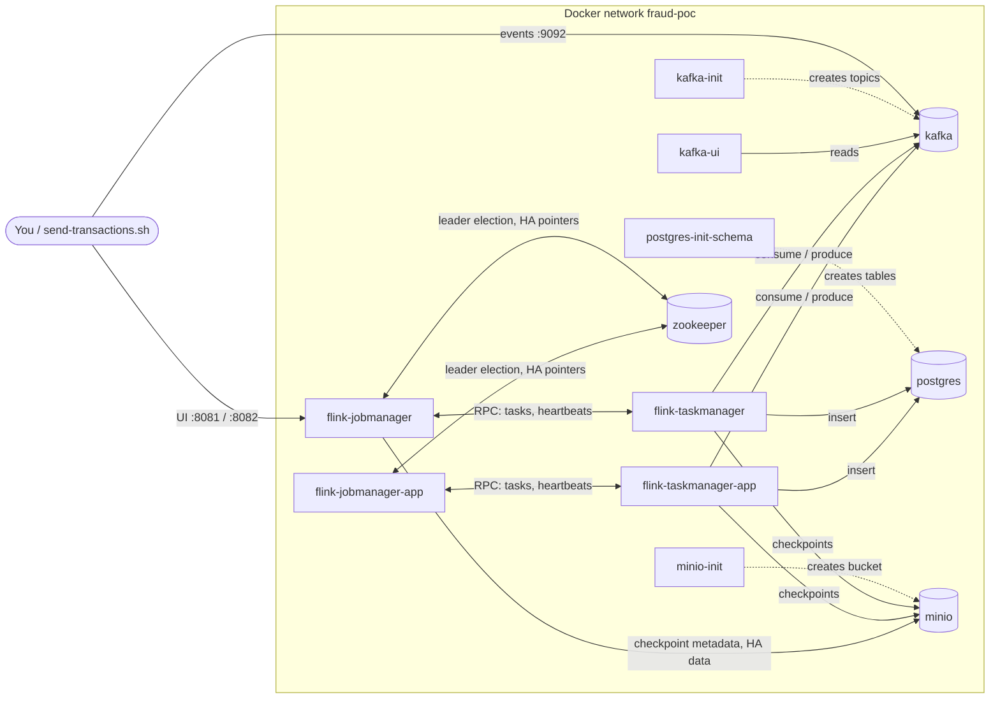
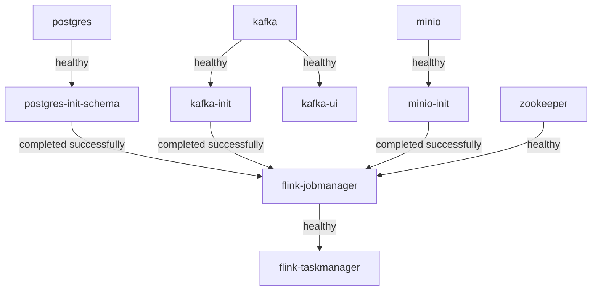

# Docker Compose services explained

🇵🇹 Versão em português: [compose-services.pt.md](compose-services.pt.md)

`docker-compose.yml` starts everything the POC needs on a laptop: a database, a message broker, an object store and a
small Flink cluster. This document explains **what each service is, which problem it solves and what breaks without it**.
The Flink part (ZooKeeper, JobManager, TaskManager and their Application Mode twins) is explained from zero.

- [1. The big picture](#1-the-big-picture)
- [2. Startup order](#2-startup-order)
- [3. Data and infrastructure services](#3-data-and-infrastructure-services)
- [4. The Flink services](#4-the-flink-services)
- [5. Session Mode vs Application Mode](#5-session-mode-vs-application-mode)
- [6. The shared Flink configuration, line by line](#6-the-shared-flink-configuration-line-by-line)
- [7. What happens when...](#7-what-happens-when)
- [8. Troubleshooting and FAQ](#8-troubleshooting-and-faq)

## 1. The big picture



Dotted arrows are **one-shot setup jobs** (they run, do their work and exit with code 0). Solid arrows are runtime traffic.
The `*-app` services only exist when you start the `app-mode` profile; you run **either** the Session pair
(`flink-jobmanager` + `flink-taskmanager`) **or** the Application pair, normally not both.

| Service | Image | Host port | Role | Lifetime |
|---|---|---|---|---|
| `postgres` | `postgres:17.11` | 5432 | Final storage of transactions, risk scores and alerts | long-running |
| `postgres-init-schema` | `flyway/flyway:11.20.3` | none | Creates/updates the tables from `db/migration` | exits 0 |
| `kafka` | `apache/kafka:4.3.1` | 9092 | Message broker (input and output topics) | long-running |
| `kafka-init` | `apache/kafka:4.3.1` | none | Creates the topics (idempotent) | exits 0 |
| `kafka-ui` | `provectuslabs/kafka-ui:v0.7.2` | 8080 | Web UI to look at topics and messages | long-running |
| `minio` | `fraud-poc/minio:RELEASE.2025-04-22T22-12-26Z` (built from `docker/minio`) | 9000 API, 9001 console | S3-compatible storage for Flink state | long-running |
| `minio-init` | same as `minio` | none | Creates the bucket `flink-state` | exits 0 |
| `zookeeper` | `zookeeper:3.9.6` | none | Coordination for Flink high availability | long-running |
| `flink-jobmanager` | `flink:2.2.1-java17` | 8081 | Flink cluster brain, Session Mode | long-running |
| `flink-taskmanager` | `flink:2.2.1-java17` | none | Flink worker, Session Mode (scalable) | long-running |
| `flink-jobmanager-app` | `flink:2.2.1-java17` | 8082 | Flink brain that starts with the job, Application Mode | profile `app-mode` |
| `flink-taskmanager-app` | `flink:2.2.1-java17` | none | Flink worker, Application Mode | profile `app-mode` |

Host ports can be overridden through `.env` (see `.env.example`); the numbers above are the defaults.

## 2. Startup order

Compose does not just start containers in parallel: `depends_on` with a health condition makes each service wait for what
it needs.



In words: the JobManager starts only after the tables exist, the topics exist, the bucket exists and ZooKeeper is healthy;
the TaskManager starts only after the JobManager answers on `/overview`. This is why `docker compose up -d` may take a
minute before everything is `healthy`. After it settles, `docker compose ps` should show the three `*-init` services as
`Exited (0)`: that is success, not a problem. The Application Mode services follow the same rules (see the compose file).

## 3. Data and infrastructure services

### postgres
**What:** the PostgreSQL 17 database. **Problem it solves:** durable, queryable storage of the pipeline results (tables
`transactions`, `risk_scores`, `fraud_alerts`). Kafka is great for moving events, not for answering "show me all alerts
of customer X". **Without it:** the job cannot write results and fails (and retries) until it is back. Data lives in
`.data/postgres`, so it survives `docker compose down`.

### postgres-init-schema
**What:** a Flyway container that applies the SQL files of `db/migration` and exits. **Problem it solves:** nobody has to
create tables by hand, and the schema is versioned. It is safe to run any number of times: Flyway only applies what is
missing.

### kafka
**What:** Apache Kafka 4.3.1 in KRaft mode (no ZooKeeper needed by Kafka itself), single node, acting as broker and
controller. **Problem it solves:** it decouples producers from the job. Transactions arrive in `transaction.events`;
results leave through `transaction.risk.events`, `fraud.high-risk.alerts` and `transaction.invalid.events`. It has two
listeners because a container and your laptop reach it by different names:

| Listener | Address | Used by |
|---|---|---|
| `INTERNAL` | `kafka:19092` | other containers (Flink, kafka-ui, kafka-init) |
| `EXTERNAL` | `localhost:9092` | your laptop (scripts, local app, IDE) |

Topics are never auto-created (`KAFKA_AUTO_CREATE_TOPICS_ENABLE=false`), so a typo in a topic name fails loudly instead of
silently creating a new topic. **Without it:** nothing flows.

### kafka-init
**What:** runs `docker/kafka/create-topics.sh` and exits. **Problem it solves:** creates the topics with the configured
number of partitions (`KAFKA_PARTITIONS`, default 6) using `--if-not-exists`, so running it again is harmless.

### kafka-ui
**What:** a web UI on <http://localhost:8080>. **Problem it solves:** lets you see topics, partitions and messages without
typing console-consumer commands. Optional for the pipeline itself.

### minio
**What:** MinIO, an S3-compatible object store, built from `docker/minio/Dockerfile` because the official image is no
longer published. **Problem it solves:** Flink needs a *shared* place to store checkpoints, savepoints and HA metadata
that every JobManager and TaskManager can reach, even after one of them dies. In production that would be AWS S3; MinIO
gives the same API locally (path-style access is required, which the Flink configuration sets). Console:
<http://localhost:9001>. **Without it:** checkpoints fail, so the job cannot recover state.

### minio-init
**What:** creates the bucket `flink-state` and exits (idempotent). **Problem it solves:** Flink does not create buckets;
without this step the first checkpoint would fail with "bucket does not exist".

## 4. The Flink services

### 4.1 Five ideas you need first

1. **A Flink job is a long-running program.** It reads events, transforms them and writes results, forever (streaming).
   It is not a request/response server.
2. **The program is split in two roles.** One process decides *what runs where* (the **JobManager**), other processes do
   the actual work (the **TaskManagers**). Think of a restaurant: the JobManager is the head waiter who assigns tables and
   keeps track of the orders; the TaskManagers are the cooks.
3. **Slots and parallelism.** A TaskManager offers a number of *slots*, each one able to run one parallel copy of the
   pipeline. Here each TaskManager has 3 slots (`taskmanager.numberOfTaskSlots: 3`) and the job runs with parallelism 3,
   so one TaskManager is enough; the 3 copies each handle a share of the customers.
4. **State and checkpoints.** The job remembers things (which transaction ids it has seen, the recent transactions of each
   customer). That is *state*. Every 10 seconds Flink takes a consistent snapshot of all state plus the Kafka offsets: a
   *checkpoint*. If something crashes, Flink restores the last checkpoint and continues, losing nothing.
5. **Checkpoints must live outside the processes that die.** That is why they go to MinIO (S3) and not to the container's
   disk.

### 4.2 zookeeper

**What it is.** A small, battle-tested coordination service (`zookeeper:3.9.6`). It does **not** process events and the
transactions never touch it.

**Problem it solves.** The JobManager is a single process, so on its own it is a *single point of failure*: if it dies
and restarts, it has forgotten which jobs were running and which checkpoint was the latest. With high availability, the
JobManager writes down two things and ZooKeeper provides the safe place to keep the small "pointers":

- **Leader election.** Who is *the* active JobManager right now. If you ever run several JobManagers, ZooKeeper makes sure
  exactly one is the leader and the others wait.
- **Recovery pointers.** "The running job is X; its latest checkpoint is at this S3 path." The heavy data (job graph,
  checkpoint metadata) is stored in S3 under `s3://flink-state/ha`; ZooKeeper only holds the pointers to it.

Analogy: the restaurant's head waiter keeps a notebook in a locked drawer (ZooKeeper) saying "table 4 ordered X, the
recipe card is in the pantry (S3)". If the head waiter is replaced mid-service, the new one opens the drawer and carries on.

**Relevant configuration** (see section 6): `high-availability.type: zookeeper`, quorum `zookeeper:2181`, root
`/flink`, `cluster-id` `/fraud-poc`.

**Things to know.**
- The Session cluster uses `cluster-id=/fraud-poc` and the Application cluster `/fraud-poc-app`. Different ids keep the two
  clusters from reading each other's recovery data.
- One ZooKeeper node is enough for a POC; production uses an odd quorum (3 or 5).
- Without ZooKeeper the JobManagers do not start (they are configured for HA), and a restarted JobManager would not
  resume the job.
- Data in `.data/zookeeper`. If you wipe `.data/minio` but keep `.data/zookeeper` (or the opposite), the pointers and the
  data disagree and the JobManager may fail to recover. Reset them together: `docker compose down && rm -rf .data`.

### 4.3 flink-jobmanager (Session Mode)

**What it is.** The Flink "brain" of the *session* cluster, `flink:2.2.1-java17` started with `command: jobmanager`. It
exposes the Web UI and REST API on <http://localhost:8081>.

**Problem it solves.** Somebody must accept the job, turn it into tasks, assign them to free slots, trigger a checkpoint
every 10 s, notice a dead worker and apply the restart strategy (exponential backoff from 1 s up to 60 s). That is the
JobManager. It processes no events itself.

**Session Mode in one sentence.** The cluster is started *empty* and stays up; you submit jobs to it afterwards
(`scripts/flink/upload-job.sh` uploads the JAR through REST and starts it). Several jobs may share the cluster, and the
cluster outlives each job.

**What is special in this compose file.**
- It starts through `docker/flink/session-entrypoint.sh`, which copies the plugin JARs (validation and fraud rules, from `dist/usrlib`)
  into Flink's `lib/` folder before starting Flink. Reason (spike [S1](spikes/S1-plugin-classloading.md)): in Session
  Mode the `usrlib/` folder is **not** on the classpath, so the job could not discover the rules through `ServiceLoader`.
  Consequence: **changing a rule means running `scripts/stage-dist.sh` and restarting the Flink containers**; there is no
  hot reload, by design.
- It waits for `postgres-init-schema`, `kafka-init`, `minio-init` and `zookeeper`, so the job never starts against missing
  tables, topics or bucket.
- `ENABLE_BUILT_IN_PLUGINS: flink-s3-fs-hadoop-2.2.1.jar` activates the S3 file system that talks to MinIO.
- Memory: `jobmanager.memory.process.size: 1536m`.

**Without it:** nothing can be submitted or scheduled, and running jobs lose their coordinator (with HA they resume once
a JobManager is back).

### 4.4 flink-taskmanager (Session Mode)

**What it is.** The worker, started with `command: taskmanager`. It registers itself at the JobManager (`jobmanager.rpc.address:
flink-jobmanager`) and offers its 3 slots.

**Problem it solves.** It executes the pipeline: reads from Kafka, runs validation, deduplication and risk rules, keeps the
RocksDB state on its disk, writes to Kafka and PostgreSQL, and uploads its part of each checkpoint to MinIO. 2048 MB of
process memory (`taskmanager.memory.process.size`).

**It scales.** The service has no fixed container name and no fixed host port, so you can add workers:

```bash
docker compose up -d --scale flink-taskmanager=3
```

Each extra TaskManager adds 3 slots. Remember that the useful parallelism is capped by the number of Kafka partitions (6 by
default): more slots than partitions leave some source tasks idle. Submit the job with a parallelism that matches (the
deploy script passes `parallelism` explicitly because the cluster default is not applied by the REST `run` call, see S1).

**Same plugin rule as the JobManager.** It also starts through `session-entrypoint.sh`, because the rules are loaded by
the *tasks*, and the tasks run here.

**Without it:** the JobManager has no slots, so the job stays `SCHEDULED`/`CREATED` and `upload-job.sh` waits for slots.
If a TaskManager dies while the job runs, the JobManager restarts the job from the last checkpoint on the remaining/new
TaskManagers.

### 4.5 flink-jobmanager-app (Application Mode)

**What it is.** The brain of a *dedicated* cluster for one application, started with
`command: standalone-job --job-classname io.github.jlmc.fraud.bootstrap.FraudJob`. Only exists with the profile `app-mode`.
UI on <http://localhost:8082> (a different port so it can coexist with 8081).

**Problem it solves.** Session Mode has an extra manual step (upload + run) and many jobs share one cluster. In
**Application Mode** the job is *part of the cluster*: the container starts, finds the job JAR in `usrlib/` and runs it
immediately. When the job ends, the cluster ends. That gives resource isolation (one cluster per application), nothing to
submit by hand, and is the pattern production deployments (Kubernetes, YARN) usually prefer.

**What is special.**
- The job JAR (`dist/job`) and the plugin JARs (`dist/usrlib`) are mounted under `/opt/flink/usrlib/` (subfolders are
  scanned). In this mode `usrlib` *is* on the classpath, so no copying into `lib/` is needed.
- `-Dhigh-availability.cluster-id=/fraud-poc-app` and `-Djobmanager.rpc.address=flink-jobmanager-app` override two values
  of the shared configuration so this cluster does not clash with the Session cluster in ZooKeeper and finds its own
  TaskManagers.
- Extra program arguments through `FLINK_APP_ARGS`, e.g. restore from a savepoint:

  ```bash
  FLINK_APP_ARGS="--fromSavepoint s3://flink-state/savepoints/savepoint-xxxx" \
    docker compose --profile app-mode up -d flink-jobmanager-app flink-taskmanager-app
  ```
- Depends on the same init services and ZooKeeper as the session JobManager.

### 4.6 flink-taskmanager-app (Application Mode)

**What it is.** The worker of the Application cluster (`command: taskmanager`), pointing at `flink-jobmanager-app` and using
the same `cluster-id`.

**Problem it solves.** Same job as the session TaskManager: execute the tasks. It needs its own mounts of `usrlib/`
because the job classes and the rules are loaded **inside the TaskManagers**. Spike S1 observed it: with `usrlib` on the
JobManager only, the TaskManager throws `ClassNotFoundException` for the job classes. Hence both application containers
mount the same two folders.

**Without it:** the application JobManager starts, has no slots, and the job never runs.

## 5. Session Mode vs Application Mode

| | Session Mode (default) | Application Mode (`--profile app-mode`) |
|---|---|---|
| Services | `flink-jobmanager`, `flink-taskmanager` | `flink-jobmanager-app`, `flink-taskmanager-app` |
| How the job starts | You submit it (`scripts/flink/upload-job.sh`) | Starts by itself with the container |
| Web UI | <http://localhost:8081> | <http://localhost:8082> |
| Plugin JARs | Copied into `lib/` at container start | Mounted in `usrlib/` of every container |
| Several jobs per cluster | Yes | No, one application per cluster |
| Changing a rule or the job | Re-stage, restart Flink containers, resubmit | Re-stage, recreate the containers |
| Best for | Iterating locally, trying scenarios | Mimicking a production deployment |

Switching from one to the other (they share Kafka, PostgreSQL and the consumer group, so never run both at once):

```bash
docker compose stop flink-jobmanager flink-taskmanager
docker compose --profile app-mode up -d flink-jobmanager-app flink-taskmanager-app
```

## 6. The shared Flink configuration, line by line

Defined once in `x-flink-properties` and injected into every Flink container through `FLINK_PROPERTIES`. The values are
POC examples, not tuned for production.

| Key | Value | Meaning |
|---|---|---|
| `jobmanager.rpc.address` | `flink-jobmanager` | Where workers find the JobManager (overridden in Application Mode) |
| `jobmanager.memory.process.size` | `1536m` | Total memory of the JobManager process |
| `taskmanager.memory.process.size` | `2048m` | Total memory of each TaskManager process |
| `taskmanager.numberOfTaskSlots` | `3` (`FLINK_TASK_SLOTS`) | Parallel copies one TaskManager can run |
| `parallelism.default` | `3` (`FLINK_PARALLELISM`) | Default parallelism of a job |
| `state.backend.type` | `rocksdb` | State kept on local disk (RocksDB) instead of the JVM heap, so it can exceed memory |
| `execution.checkpointing.incremental` | `true` | Each checkpoint uploads only what changed |
| `execution.checkpointing.dir` | `s3://flink-state/checkpoints` | Where checkpoints go (MinIO) |
| `execution.checkpointing.savepoint-dir` | `s3://flink-state/savepoints` | Where manual savepoints go |
| `execution.checkpointing.interval` | `10s` | A checkpoint every 10 seconds (also how long a Kafka sink transaction stays uncommitted) |
| `execution.checkpointing.timeout` | `2min` | A checkpoint taking longer than this fails |
| `execution.checkpointing.min-pause` | `5s` | Minimum gap between two checkpoints |
| `execution.checkpointing.tolerable-failed-checkpoints` | `3` | Failed checkpoints in a row before the job fails |
| `execution.checkpointing.externalized-checkpoint-retention` | `RETAIN_ON_CANCELLATION` | Keep the checkpoint when you cancel the job, so you can restore from it |
| `execution.checkpointing.num-retained` | `3` | How many completed checkpoints are kept |
| `restart-strategy.type` | `exponential-delay` | After a failure, wait before restarting, longer each time |
| `restart-strategy.exponential-delay.*` | 1s initial, 60s max, x2, jitter 0.1, reset after 5min | Backoff schedule; jitter avoids synchronized retries; resets after 5 stable minutes |
| `high-availability.type` | `zookeeper` | Use ZooKeeper for leader election and recovery pointers |
| `high-availability.zookeeper.quorum` | `zookeeper:2181` | Where ZooKeeper is |
| `high-availability.zookeeper.path.root` | `/flink` | Folder inside ZooKeeper |
| `high-availability.cluster-id` | `/fraud-poc` (`/fraud-poc-app` in app mode) | Namespace of this cluster inside ZooKeeper |
| `high-availability.storageDir` | `s3://flink-state/ha` | Where the heavy HA data (job graph, metadata) lives |
| `s3.endpoint` | `http://minio:9000` | S3 server (MinIO) |
| `s3.path-style-access` | `true` | MinIO needs `host/bucket` addressing instead of `bucket.host` |
| `s3.access-key` / `s3.secret-key` | `minioadmin` (`S3_ACCESS_KEY`, `S3_SECRET_KEY`) | Local-only credentials |

## 7. What happens when...

**...I submit the job (Session Mode).** `upload-job.sh` waits until the TaskManager has registered its slots, uploads the
JAR to the JobManager, and starts it with parallelism 3. The JobManager deploys the 3 parallel copies into the 3 slots; they
start reading `transaction.events`.

**...a TaskManager dies.** The JobManager stops receiving its heartbeats, declares it lost, and applies the restart
strategy: after the backoff it restarts the job from the last checkpoint on the available slots (a new TaskManager must
exist, `restart: unless-stopped` brings the container back). Kafka offsets and state go back to the checkpoint, so nothing
is lost; the Kafka sinks are transactional, so consumers using `read_committed` see no duplicates.

**...the JobManager dies.** The running TaskManagers notice and wait. When Docker restarts the JobManager it asks ZooKeeper
"was I leading a job?", reads the job graph and the latest checkpoint from `s3://flink-state/ha`, and resumes the job.
This is the whole reason ZooKeeper is in the stack.

**...I restart everything (`docker compose down` then `up`).** Postgres, Kafka, MinIO and ZooKeeper data are on disk in
`.data/`, so the pointers and the data are still consistent. The retained checkpoints exist in MinIO, but a *new*
submission starts from scratch unless you restore from a checkpoint or savepoint explicitly (`scripts/flink/` and
`FLINK_APP_ARGS`).

**...I want a clean slate.** `docker compose down && rm -rf .data`.

> The failover behaviours above describe how Flink and this configuration are designed to work. The automated tests prove
> recovery with a simulated failure on an in-JVM cluster; killing real TaskManager/JobManager containers is not yet covered
> by an automated script.

## 8. Troubleshooting and FAQ

| Symptom | Likely cause | Fix |
|---|---|---|
| `docker compose ps` shows `*-init` as `Exited (0)` | Normal: setup jobs finished | Nothing to do |
| `flink-jobmanager` stays in `Created`/`Waiting` | An init service failed or ZooKeeper unhealthy | `docker compose ps -a`, then `docker compose logs <service>` |
| Job fails with "no validation rules" or "no TransactionRiskRule" | Plugins not staged or Flink not restarted after staging | `scripts/stage-dist.sh`, then `docker compose restart flink-jobmanager flink-taskmanager` |
| `ClassNotFoundException` in Application Mode | `usrlib` mounted only on the JobManager | Keep both `*-app` services with the same volumes |
| Checkpoints fail, "bucket does not exist" | `minio-init` did not run or `.data/minio` was wiped | `docker compose up -d minio-init` |
| JobManager cannot recover after a wipe | `.data/zookeeper` and `.data/minio` out of sync | `docker compose down && rm -rf .data` |
| Job stuck waiting for slots | No TaskManager, or slots all used | `docker compose ps`, scale with `--scale flink-taskmanager=N` |
| Two Flink UIs, which one? | Session 8081, Application 8082 | Only run one pair |
| Why is ZooKeeper needed if Kafka is KRaft? | They are unrelated: Kafka needs none, **Flink HA** needs ZooKeeper (or Kubernetes) | n/a |
