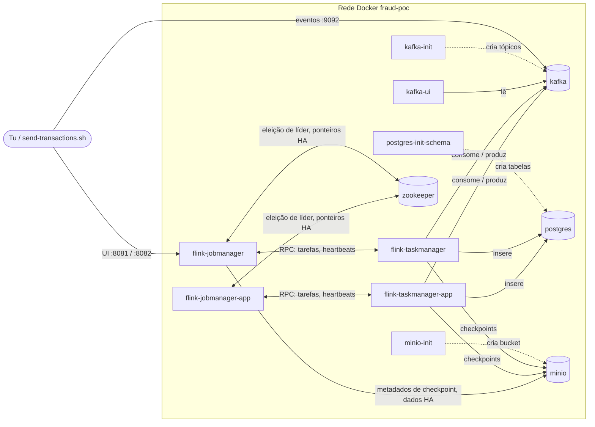
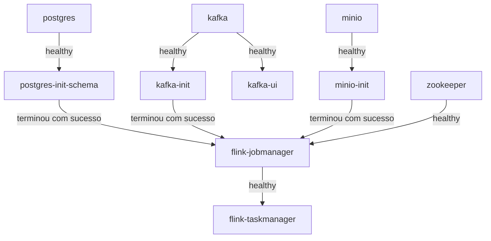

# Serviços do Docker Compose explicados

🇬🇧 English version: [compose-services.md](compose-services.md)

O `docker-compose.yml` arranca tudo o que o POC precisa num portátil: uma base de dados, um broker de mensagens, um
armazenamento de objetos e um pequeno cluster Flink. Este documento explica **o que é cada serviço, que problema resolve e
o que deixa de funcionar sem ele**. A parte Flink (ZooKeeper, JobManager, TaskManager e os equivalentes em Application
Mode) é explicada de raiz.

- [1. Visão geral](#1-visão-geral)
- [2. Ordem de arranque](#2-ordem-de-arranque)
- [3. Serviços de dados e infraestrutura](#3-serviços-de-dados-e-infraestrutura)
- [4. Os serviços Flink](#4-os-serviços-flink)
- [5. Session Mode vs Application Mode](#5-session-mode-vs-application-mode)
- [6. A configuração Flink partilhada, linha a linha](#6-a-configuração-flink-partilhada-linha-a-linha)
- [7. O que acontece quando...](#7-o-que-acontece-quando)
- [8. Resolução de problemas e FAQ](#8-resolução-de-problemas-e-faq)

## 1. Visão geral



As setas a tracejado são **jobs de preparação** (correm, fazem o trabalho e terminam com código 0). As setas cheias são
tráfego em runtime. Os serviços `*-app` só existem quando arrancas o perfil `app-mode`; corres **ou** o par Session
(`flink-jobmanager` + `flink-taskmanager`) **ou** o par Application, normalmente não os dois.

| Serviço | Imagem | Porta no host | Papel | Duração |
|---|---|---|---|---|
| `postgres` | `postgres:17.11` | 5432 | Armazenamento final de transações, scores de risco e alertas | permanente |
| `postgres-init-schema` | `flyway/flyway:11.20.3` | nenhuma | Cria/atualiza as tabelas de `db/migration` | termina com 0 |
| `kafka` | `apache/kafka:4.3.1` | 9092 | Broker de mensagens (tópicos de entrada e saída) | permanente |
| `kafka-init` | `apache/kafka:4.3.1` | nenhuma | Cria os tópicos (idempotente) | termina com 0 |
| `kafka-ui` | `provectuslabs/kafka-ui:v0.7.2` | 8080 | UI web para ver tópicos e mensagens | permanente |
| `minio` | `fraud-poc/minio:RELEASE.2025-04-22T22-12-26Z` (construída de `docker/minio`) | 9000 API, 9001 consola | Armazenamento compatível com S3 para o estado do Flink | permanente |
| `minio-init` | igual a `minio` | nenhuma | Cria o bucket `flink-state` | termina com 0 |
| `zookeeper` | `zookeeper:3.9.6` | nenhuma | Coordenação para a alta disponibilidade do Flink | permanente |
| `flink-jobmanager` | `flink:2.2.1-java17` | 8081 | Cérebro do cluster Flink, Session Mode | permanente |
| `flink-taskmanager` | `flink:2.2.1-java17` | nenhuma | Trabalhador Flink, Session Mode (escalável) | permanente |
| `flink-jobmanager-app` | `flink:2.2.1-java17` | 8082 | Cérebro que arranca já com o job, Application Mode | perfil `app-mode` |
| `flink-taskmanager-app` | `flink:2.2.1-java17` | nenhuma | Trabalhador Flink, Application Mode | perfil `app-mode` |

As portas do host podem ser alteradas no `.env` (ver `.env.example`); os números acima são os valores por omissão.

## 2. Ordem de arranque

O Compose não arranca simplesmente tudo em paralelo: `depends_on` com condição de saúde faz cada serviço esperar pelo que
precisa.



Por palavras: o JobManager só arranca depois de existirem as tabelas, os tópicos e o bucket, e de o ZooKeeper estar
saudável; o TaskManager só arranca depois de o JobManager responder em `/overview`. É por isso que o `docker compose up -d`
pode demorar um minuto até estar tudo `healthy`. Depois de estabilizar, o `docker compose ps` deve mostrar os três serviços
`*-init` como `Exited (0)`: isso é sucesso, não um problema. Os serviços do Application Mode seguem as mesmas regras (ver o
ficheiro compose).

## 3. Serviços de dados e infraestrutura

### postgres
**O que é:** a base de dados PostgreSQL 17. **Problema que resolve:** armazenamento durável e consultável dos resultados do
pipeline (tabelas `transactions`, `risk_scores`, `fraud_alerts`). O Kafka é ótimo a movimentar eventos, não a responder a
"mostra-me todos os alertas do cliente X". **Sem ele:** o job não consegue escrever resultados e falha (e tenta de novo) até
a base voltar. Os dados ficam em `.data/postgres`, por isso sobrevivem a um `docker compose down`.

### postgres-init-schema
**O que é:** um contentor Flyway que aplica os ficheiros SQL de `db/migration` e termina. **Problema que resolve:** ninguém
tem de criar tabelas à mão e o schema fica versionado. É seguro correr várias vezes: o Flyway só aplica o que falta.

### kafka
**O que é:** Apache Kafka 4.3.1 em modo KRaft (o próprio Kafka já não precisa de ZooKeeper), nó único, como broker e
controller. **Problema que resolve:** desacopla quem produz do job. As transações chegam a `transaction.events`; os
resultados saem por `transaction.risk.events`, `fraud.high-risk.alerts` e `transaction.invalid.events`. Tem dois listeners
porque um contentor e o teu portátil chegam-lhe por nomes diferentes:

| Listener | Endereço | Usado por |
|---|---|---|
| `INTERNAL` | `kafka:19092` | outros contentores (Flink, kafka-ui, kafka-init) |
| `EXTERNAL` | `localhost:9092` | o teu portátil (scripts, app local, IDE) |

Os tópicos nunca são criados automaticamente (`KAFKA_AUTO_CREATE_TOPICS_ENABLE=false`), por isso um erro de escrita no nome
de um tópico falha de forma visível em vez de criar um tópico novo em silêncio. **Sem ele:** nada flui.

### kafka-init
**O que é:** corre `docker/kafka/create-topics.sh` e termina. **Problema que resolve:** cria os tópicos com o número de
partições configurado (`KAFKA_PARTITIONS`, por omissão 6) com `--if-not-exists`, pelo que voltar a correr é inofensivo.

### kafka-ui
**O que é:** uma UI web em <http://localhost:8080>. **Problema que resolve:** deixa ver tópicos, partições e mensagens sem
escrever comandos de console-consumer. É opcional para o pipeline em si.

### minio
**O que é:** o MinIO, um armazenamento de objetos compatível com S3, construído a partir de `docker/minio/Dockerfile` porque
a imagem oficial deixou de ser publicada. **Problema que resolve:** o Flink precisa de um sítio *partilhado* para guardar
checkpoints, savepoints e metadados de HA que todos os JobManagers e TaskManagers consigam alcançar, mesmo depois de um
deles morrer. Em produção seria o AWS S3; o MinIO dá a mesma API localmente (é obrigatório o acesso path-style, que a
configuração do Flink define). Consola: <http://localhost:9001>. **Sem ele:** os checkpoints falham e o job não consegue
recuperar o estado.

### minio-init
**O que é:** cria o bucket `flink-state` e termina (idempotente). **Problema que resolve:** o Flink não cria buckets; sem
este passo o primeiro checkpoint falharia com "bucket does not exist".

## 4. Os serviços Flink

### 4.1 Cinco ideias de que precisas primeiro

1. **Um job Flink é um programa que corre para sempre.** Lê eventos, transforma-os e escreve resultados, continuamente
   (streaming). Não é um servidor de pedido/resposta.
2. **O programa divide-se em dois papéis.** Um processo decide *o que corre onde* (o **JobManager**), outros processos fazem
   o trabalho (os **TaskManagers**). Pensa num restaurante: o JobManager é o chefe de sala que atribui mesas e controla os
   pedidos; os TaskManagers são os cozinheiros.
3. **Slots e paralelismo.** Um TaskManager oferece um número de *slots*, cada um capaz de correr uma cópia paralela do
   pipeline. Aqui cada TaskManager tem 3 slots (`taskmanager.numberOfTaskSlots: 3`) e o job corre com paralelismo 3, por
   isso um TaskManager chega; cada uma das 3 cópias trata uma parte dos clientes.
4. **Estado e checkpoints.** O job lembra-se de coisas (que ids de transação já viu, as transações recentes de cada
   cliente). Isso é *estado*. De 10 em 10 segundos o Flink tira uma fotografia consistente de todo o estado mais os offsets
   do Kafka: um *checkpoint*. Se algo falhar, o Flink restaura o último checkpoint e continua sem perder nada.
5. **Os checkpoints têm de viver fora dos processos que morrem.** Por isso vão para o MinIO (S3) e não para o disco do
   contentor.

### 4.2 zookeeper

**O que é.** Um serviço de coordenação pequeno e muito testado (`zookeeper:3.9.6`). **Não** processa eventos e as
transações nunca passam por ele.

**Problema que resolve.** O JobManager é um único processo, logo sozinho é um *ponto único de falha*: se morrer e
reiniciar, esqueceu-se de que jobs corriam e de qual era o último checkpoint. Com alta disponibilidade, o JobManager regista
duas coisas e o ZooKeeper dá o sítio seguro para guardar os pequenos "ponteiros":

- **Eleição de líder.** Quem é *o* JobManager ativo agora. Se alguma vez correres vários JobManagers, o ZooKeeper garante
  que exatamente um é líder e os outros esperam.
- **Ponteiros de recuperação.** "O job em execução é o X; o último checkpoint está neste caminho S3." Os dados pesados (job
  graph, metadados de checkpoint) ficam no S3 em `s3://flink-state/ha`; o ZooKeeper só guarda os ponteiros para eles.

Analogia: o chefe de sala guarda um caderno numa gaveta fechada à chave (ZooKeeper) a dizer "a mesa 4 pediu X, a ficha da
receita está na despensa (S3)". Se o chefe de sala for substituído a meio do serviço, o novo abre a gaveta e continua.

**Configuração relevante** (ver secção 6): `high-availability.type: zookeeper`, quorum `zookeeper:2181`, raiz `/flink`,
`cluster-id` `/fraud-poc`.

**A saber.**
- O cluster Session usa `cluster-id=/fraud-poc` e o cluster Application `/fraud-poc-app`. Ids diferentes impedem que os dois
  clusters leiam os dados de recuperação um do outro.
- Um nó de ZooKeeper chega para um POC; em produção usa-se um quorum ímpar (3 ou 5).
- Sem ZooKeeper os JobManagers não arrancam (estão configurados para HA) e um JobManager reiniciado não retomaria o job.
- Dados em `.data/zookeeper`. Se apagares `.data/minio` mas mantiveres `.data/zookeeper` (ou o contrário), os ponteiros e os
  dados deixam de coincidir e o JobManager pode falhar a recuperação. Repõe-os em conjunto: `docker compose down && rm -rf .data`.

### 4.3 flink-jobmanager (Session Mode)

**O que é.** O "cérebro" do cluster *session*, `flink:2.2.1-java17` arrancado com `command: jobmanager`. Expõe a UI web e a
API REST em <http://localhost:8081>.

**Problema que resolve.** Alguém tem de aceitar o job, convertê-lo em tarefas, atribuí-las a slots livres, disparar um
checkpoint de 10 em 10 s, detetar um trabalhador morto e aplicar a restart strategy (backoff exponencial de 1 s até 60 s).
Isso é o JobManager. Não processa eventos.

**Session Mode numa frase.** O cluster arranca *vazio* e fica de pé; submetes-lhe jobs depois
(`scripts/flink/upload-job.sh` envia o JAR por REST e arranca-o). Vários jobs podem partilhar o cluster e o cluster sobrevive
a cada job.

**O que é especial neste compose.**
- Arranca através de `docker/flink/session-entrypoint.sh`, que copia os JARs dos plugins de regras de validação (de
  `dist/usrlib`) para a pasta `lib/` do Flink antes de o arrancar. Razão (spike [S1](spikes/S1-plugin-classloading.md)): em
  Session Mode a pasta `usrlib/` **não** está no classpath, logo o job não conseguiria descobrir as regras com
  `ServiceLoader`. Consequência: **mudar uma regra implica correr `scripts/stage-dist.sh` e reiniciar os contentores
  Flink**; não há hot reload, por desenho.
- Espera por `postgres-init-schema`, `kafka-init`, `minio-init` e `zookeeper`, para o job nunca arrancar contra tabelas,
  tópicos ou bucket em falta.
- `ENABLE_BUILT_IN_PLUGINS: flink-s3-fs-hadoop-2.2.1.jar` ativa o sistema de ficheiros S3 que fala com o MinIO.
- Memória: `jobmanager.memory.process.size: 1536m`.

**Sem ele:** nada pode ser submetido nem agendado e os jobs em execução perdem o coordenador (com HA retomam quando um
JobManager voltar).

### 4.4 flink-taskmanager (Session Mode)

**O que é.** O trabalhador, arrancado com `command: taskmanager`. Regista-se no JobManager (`jobmanager.rpc.address:
flink-jobmanager`) e oferece os seus 3 slots.

**Problema que resolve.** Executa o pipeline: lê do Kafka, corre validação, deduplicação e regras de risco, mantém o estado
RocksDB no seu disco, escreve no Kafka e no PostgreSQL e envia a sua parte de cada checkpoint para o MinIO. 2048 MB de
memória de processo (`taskmanager.memory.process.size`).

**Escala.** O serviço não tem nome de contentor fixo nem porta fixa no host, por isso podes acrescentar trabalhadores:

```bash
docker compose up -d --scale flink-taskmanager=3
```

Cada TaskManager extra acrescenta 3 slots. Lembra-te de que o paralelismo útil é limitado pelo número de partições Kafka
(6 por omissão): mais slots do que partições deixam tarefas de source inativas. Submete o job com um paralelismo coerente (o
script de deploy passa o `parallelism` explicitamente porque o valor por omissão do cluster não é aplicado pela chamada REST
`run`, ver S1).

**Mesma regra de plugins do JobManager.** Também arranca por `session-entrypoint.sh`, porque as regras são carregadas pelas
*tarefas*, e as tarefas correm aqui.

**Sem ele:** o JobManager não tem slots, o job fica em `SCHEDULED`/`CREATED` e o `upload-job.sh` fica à espera de slots. Se
um TaskManager morrer com o job a correr, o JobManager reinicia o job a partir do último checkpoint nos TaskManagers
restantes/novos.

### 4.5 flink-jobmanager-app (Application Mode)

**O que é.** O cérebro de um cluster *dedicado* a uma aplicação, arrancado com
`command: standalone-job --job-classname io.github.jlmc.fraud.bootstrap.FraudJob`. Só existe com o perfil `app-mode`. UI em
<http://localhost:8082> (porta diferente para poder coexistir com a 8081).

**Problema que resolve.** O Session Mode tem um passo manual extra (upload + run) e vários jobs partilham um cluster. No
**Application Mode** o job faz *parte do cluster*: o contentor arranca, encontra o JAR do job em `usrlib/` e executa-o logo.
Quando o job termina, o cluster termina. Isto dá isolamento de recursos (um cluster por aplicação), nada para submeter à mão
e é o padrão que os deploys de produção (Kubernetes, YARN) normalmente preferem.

**O que é especial.**
- O JAR do job (`dist/job`) e os JARs dos plugins (`dist/usrlib`) são montados em `/opt/flink/usrlib/` (as subpastas são
  analisadas). Neste modo `usrlib` *está* no classpath, por isso não é preciso copiar para `lib/`.
- `-Dhigh-availability.cluster-id=/fraud-poc-app` e `-Djobmanager.rpc.address=flink-jobmanager-app` sobrepõem dois valores da
  configuração partilhada, para este cluster não colidir com o cluster Session no ZooKeeper e encontrar os seus próprios
  TaskManagers.
- Argumentos extra do programa através de `FLINK_APP_ARGS`, por exemplo restaurar de um savepoint:

  ```bash
  FLINK_APP_ARGS="--fromSavepoint s3://flink-state/savepoints/savepoint-xxxx" \
    docker compose --profile app-mode up -d flink-jobmanager-app flink-taskmanager-app
  ```
- Depende dos mesmos serviços de init e do ZooKeeper que o JobManager session.

### 4.6 flink-taskmanager-app (Application Mode)

**O que é.** O trabalhador do cluster Application (`command: taskmanager`), a apontar para `flink-jobmanager-app` e com o
mesmo `cluster-id`.

**Problema que resolve.** O mesmo do TaskManager session: executar as tarefas. Precisa das suas próprias montagens de
`usrlib/` porque as classes do job e as regras são carregadas **dentro dos TaskManagers**. O spike S1 observou-o: com
`usrlib` só no JobManager, o TaskManager lança `ClassNotFoundException` para as classes do job. Por isso ambos os contentores
application montam as mesmas duas pastas.

**Sem ele:** o JobManager application arranca, não tem slots e o job nunca corre.

## 5. Session Mode vs Application Mode

| | Session Mode (por omissão) | Application Mode (`--profile app-mode`) |
|---|---|---|
| Serviços | `flink-jobmanager`, `flink-taskmanager` | `flink-jobmanager-app`, `flink-taskmanager-app` |
| Como o job arranca | Submetes tu (`scripts/flink/upload-job.sh`) | Arranca sozinho com o contentor |
| UI web | <http://localhost:8081> | <http://localhost:8082> |
| JARs dos plugins | Copiados para `lib/` no arranque do contentor | Montados em `usrlib/` de cada contentor |
| Vários jobs por cluster | Sim | Não, uma aplicação por cluster |
| Alterar uma regra ou o job | Re-stage, reiniciar contentores Flink, resubmeter | Re-stage, recriar os contentores |
| Melhor para | Iterar localmente, experimentar cenários | Imitar um deploy de produção |

Passar de um para o outro (partilham Kafka, PostgreSQL e o consumer group, por isso nunca corras os dois ao mesmo tempo):

```bash
docker compose stop flink-jobmanager flink-taskmanager
docker compose --profile app-mode up -d flink-jobmanager-app flink-taskmanager-app
```

## 6. A configuração Flink partilhada, linha a linha

Definida uma vez em `x-flink-properties` e injetada em todos os contentores Flink por `FLINK_PROPERTIES`. Os valores são
exemplos de POC, não otimizados para produção.

| Chave | Valor | Significado |
|---|---|---|
| `jobmanager.rpc.address` | `flink-jobmanager` | Onde os trabalhadores encontram o JobManager (sobreposto no Application Mode) |
| `jobmanager.memory.process.size` | `1536m` | Memória total do processo JobManager |
| `taskmanager.memory.process.size` | `2048m` | Memória total de cada processo TaskManager |
| `taskmanager.numberOfTaskSlots` | `3` (`FLINK_TASK_SLOTS`) | Cópias paralelas que um TaskManager consegue correr |
| `parallelism.default` | `3` (`FLINK_PARALLELISM`) | Paralelismo por omissão de um job |
| `state.backend.type` | `rocksdb` | Estado em disco local (RocksDB) em vez do heap da JVM, podendo exceder a memória |
| `execution.checkpointing.incremental` | `true` | Cada checkpoint envia só o que mudou |
| `execution.checkpointing.dir` | `s3://flink-state/checkpoints` | Para onde vão os checkpoints (MinIO) |
| `execution.checkpointing.savepoint-dir` | `s3://flink-state/savepoints` | Para onde vão os savepoints manuais |
| `execution.checkpointing.interval` | `10s` | Um checkpoint de 10 em 10 segundos (é também o tempo que uma transação do sink Kafka fica por confirmar) |
| `execution.checkpointing.timeout` | `2min` | Um checkpoint que demore mais falha |
| `execution.checkpointing.min-pause` | `5s` | Intervalo mínimo entre dois checkpoints |
| `execution.checkpointing.tolerable-failed-checkpoints` | `3` | Checkpoints falhados seguidos antes de o job falhar |
| `execution.checkpointing.externalized-checkpoint-retention` | `RETAIN_ON_CANCELLATION` | Mantém o checkpoint ao cancelar o job, para poderes restaurar |
| `execution.checkpointing.num-retained` | `3` | Quantos checkpoints concluídos se mantêm |
| `restart-strategy.type` | `exponential-delay` | Após uma falha, espera antes de reiniciar, cada vez mais |
| `restart-strategy.exponential-delay.*` | 1s inicial, 60s máx., x2, jitter 0.1, reset após 5min | Calendário de backoff; o jitter evita retentativas sincronizadas; repõe após 5 minutos estáveis |
| `high-availability.type` | `zookeeper` | Usa ZooKeeper para eleição de líder e ponteiros de recuperação |
| `high-availability.zookeeper.quorum` | `zookeeper:2181` | Onde está o ZooKeeper |
| `high-availability.zookeeper.path.root` | `/flink` | Pasta dentro do ZooKeeper |
| `high-availability.cluster-id` | `/fraud-poc` (`/fraud-poc-app` em app mode) | Namespace deste cluster no ZooKeeper |
| `high-availability.storageDir` | `s3://flink-state/ha` | Onde ficam os dados pesados de HA (job graph, metadados) |
| `s3.endpoint` | `http://minio:9000` | Servidor S3 (MinIO) |
| `s3.path-style-access` | `true` | O MinIO precisa de endereçamento `host/bucket` em vez de `bucket.host` |
| `s3.access-key` / `s3.secret-key` | `minioadmin` (`S3_ACCESS_KEY`, `S3_SECRET_KEY`) | Credenciais só para uso local |

## 7. O que acontece quando...

**...submeto o job (Session Mode).** O `upload-job.sh` espera que o TaskManager tenha registado os slots, envia o JAR ao
JobManager e arranca-o com paralelismo 3. O JobManager coloca as 3 cópias paralelas nos 3 slots; começam a ler
`transaction.events`.

**...morre um TaskManager.** O JobManager deixa de receber os heartbeats, declara-o perdido e aplica a restart strategy:
após o backoff reinicia o job a partir do último checkpoint nos slots disponíveis (tem de existir um novo TaskManager; o
`restart: unless-stopped` volta a levantar o contentor). Offsets Kafka e estado voltam ao checkpoint, logo nada se perde; os
sinks Kafka são transacionais, por isso consumidores com `read_committed` não veem duplicados.

**...morre o JobManager.** Os TaskManagers em execução notam e esperam. Quando o Docker reinicia o JobManager, este pergunta
ao ZooKeeper "eu liderava algum job?", lê o job graph e o último checkpoint de `s3://flink-state/ha` e retoma o job. É esta
a razão de o ZooKeeper estar na stack.

**...reinicio tudo (`docker compose down` e depois `up`).** Os dados do Postgres, Kafka, MinIO e ZooKeeper estão em disco em
`.data/`, logo ponteiros e dados continuam coerentes. Os checkpoints retidos existem no MinIO, mas uma submissão *nova* começa
do zero a menos que restaures explicitamente de um checkpoint ou savepoint (`scripts/flink/` e `FLINK_APP_ARGS`).

**...quero começar do zero.** `docker compose down && rm -rf .data`.

> Os comportamentos de failover acima descrevem como o Flink e esta configuração foram desenhados para funcionar. Os testes
> automáticos provam a recuperação com uma falha simulada num cluster dentro da JVM; matar contentores reais de
> TaskManager/JobManager ainda não está coberto por um script automático.

## 8. Resolução de problemas e FAQ

| Sintoma | Causa provável | Solução |
|---|---|---|
| `docker compose ps` mostra `*-init` como `Exited (0)` | Normal: os jobs de preparação terminaram | Nada a fazer |
| `flink-jobmanager` fica em `Created`/`Waiting` | Um serviço de init falhou ou o ZooKeeper não está saudável | `docker compose ps -a` e depois `docker compose logs <serviço>` |
| O job falha com "no validation rules" | Plugins não preparados, ou Flink não reiniciado após o stage | `scripts/stage-dist.sh` e depois `docker compose restart flink-jobmanager flink-taskmanager` |
| `ClassNotFoundException` em Application Mode | `usrlib` montado só no JobManager | Mantém os dois serviços `*-app` com os mesmos volumes |
| Checkpoints falham, "bucket does not exist" | O `minio-init` não correu ou `.data/minio` foi apagado | `docker compose up -d minio-init` |
| O JobManager não recupera após apagar dados | `.data/zookeeper` e `.data/minio` dessincronizados | `docker compose down && rm -rf .data` |
| Job preso à espera de slots | Sem TaskManager, ou slots todos ocupados | `docker compose ps`, escala com `--scale flink-taskmanager=N` |
| Duas UIs Flink, qual é qual? | Session 8081, Application 8082 | Corre só um dos pares |
| Porquê ZooKeeper se o Kafka é KRaft? | Não têm relação: o Kafka não precisa, a **HA do Flink** precisa de ZooKeeper (ou Kubernetes) | n/a |
