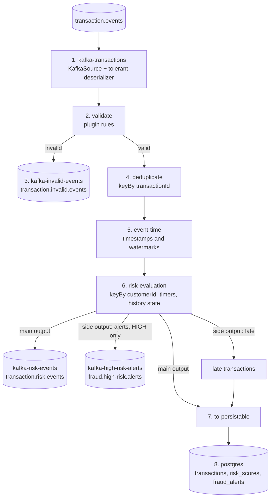

# The Flink pipeline, step by step

🇵🇹 Versão em português: [pipeline.pt.md](pipeline.pt.md)

This document explains **what each step of the dataflow does, which problem it solves and why it sits exactly where it
does**. The order of the steps is defined in one place, `PipelineAssembler`
([source](../flink-job/src/main/java/io/github/jlmc/fraud/bootstrap/PipelineAssembler.java)); the sinks are attached in
`FraudJob.build` ([source](../flink-job/src/main/java/io/github/jlmc/fraud/bootstrap/FraudJob.java)).

- [1. The whole flow](#1-the-whole-flow)
- [2. Step by step](#2-step-by-step)
- [3. Why this order](#3-why-this-order)
- [4. The state the job keeps](#4-the-state-the-job-keeps)
- [5. Metrics per step](#5-metrics-per-step)
- [6. Delivery guarantees per boundary](#6-delivery-guarantees-per-boundary)
- [7. A transaction's journey: examples](#7-a-transactions-journey-examples)

## 1. The whole flow

Reading guide: boxes numbered 1 to 8 are the pipeline steps; cylinders are Kafka topics or PostgreSQL. Three of the
sinks are fed by **side outputs** (invalid, alerts, late): one operator emits several kinds of results without being split
into several operators, which is Flink's recommended pattern (`OutputTag`).

## 2. Step by step

### 1. `kafka-transactions`: read from Kafka without ever crashing

| | |
|---|---|
| **What** | A `KafkaSource` reads `transaction.events` and turns each record into an `IncomingMessage` (parsed transaction **or** an error plus the raw payload and its topic/partition/offset). |
| **Problem it solves** | Getting data in, and surviving garbage. A single unparseable message must not stop the job. |
| **Why this way** | A deserializer that throws makes Flink restart, re-read the same record, throw again, and loop forever (a *poison message*). `IncomingMessageDeserializationSchema` never throws: bad JSON, wrong types, an empty or non-object payload all become an `IncomingMessage` that carries the error. Missing fields are *not* a parse error: the transaction is produced with nulls so the validation plugins decide. |
| **Offsets** | Starts from the offsets committed by a previous run, or from the earliest offset if none. When restored from a checkpoint/savepoint, Flink's own stored offsets win (Kafka's committed offsets only feed lag monitoring). New partitions are discovered every 30 s. |
| **Watermarks here** | `noWatermarks()`: event time is assigned later (step 5), after the data is clean. |

### 2. `validate`: reject bad business data, with pluggable rules

| | |
|---|---|
| **What** | `ValidationProcessFunction` runs the validation rules found by `ServiceLoader` (`validation-rules/*`: amount greater than 0 `AMOUNT_NOT_POSITIVE`, supported currency `CURRENCY_NOT_SUPPORTED`, required fields `REQUIRED_FIELD_MISSING`). Valid transactions continue; everything else goes to the `INVALID` side output. |
| **Problem it solves** | Garbage in the later steps. Risk rules and the database assume a well-formed transaction (non-null amount, customer, timestamp); this is the gate that guarantees it. |
| **Why plugins** | Which data is acceptable is a business decision that changes more often than the pipeline. Rules live in independent JARs discovered at start-up, so adding a rule means adding a JAR, not editing the job (see [S1](spikes/S1-plugin-classloading.md)). |
| **Why first** | It is cheap and stateless, so it removes bad records before the expensive, stateful steps and before any shuffle. |
| **Failure handling** | Both kinds of rejection (malformed payload, rule violation) become an `InvalidEvent` with a code, a message, the original payload and the Kafka coordinates, so a rejected record can be diagnosed and replayed. Nothing invalid ever restarts the job. |
| **Where it runs** | Rules are loaded in `open()` on the TaskManager (never serialized with the job), using the context classloader. The job fails fast at start-up if no rule is found. |

### 3. `kafka-invalid-events`: the dead-letter topic

| | |
|---|---|
| **What** | Sink of the `INVALID` side output to `transaction.invalid.events`, keyed by transaction id. |
| **Problem it solves** | Rejected input must not vanish silently, and must not block the main flow. |
| **Why AT_LEAST_ONCE** | A duplicated dead-letter record is harmless, and Kafka transactions have a cost per record. The risk topic and the alerts topic are different: a duplicate there would be a duplicated business result, so they are EXACTLY_ONCE. |

### 4. `deduplicate`: the same transaction twice counts once

| | |
|---|---|
| **What** | `keyBy(transactionId)` then `DeduplicationFunction`: the first occurrence passes, later ones are dropped. |
| **Problem it solves** | Kafka producers retry and upstream systems resend. Without this, a retried transaction would be counted twice in the velocity and spending rules and could push a customer into a false HIGH alert. |
| **How** | A `ValueState<Boolean>` per transaction id ("seen") with a **24 h TTL**, so state is bounded instead of growing forever. |
| **Limits (honest)** | The TTL is measured in *processing* time: a duplicate that arrives more than 24 h of wall clock later is treated as new. PostgreSQL's primary key (`ON CONFLICT DO NOTHING`) is the last line of defence for the database, though not for the Kafka topics. |
| **Why a separate keyBy** | Deduplication needs all copies of an id on the same subtask, and the risk step needs all transactions of a customer on the same subtask. Those are different keys, so there is one extra shuffle. That is the price of correctness. |

### 5. `event-time`: tell Flink what time it really is

| | |
|---|---|
| **What** | `assignTimestampsAndWatermarks` with `forBoundedOutOfOrderness(30 s)` and `withIdleness(30 s)`; the timestamp is the transaction's own `timestamp` field. |
| **Problem it solves** | Rules such as "more than 5 transactions in 1 minute" must be about *when the purchase happened*, not when the message arrived. Processing time would give different answers for the same data depending on lag, replays and restarts. |
| **Watermark** | A promise: "nothing older than T will arrive anymore". `bounded out-of-orderness 30 s` means the watermark trails the newest event by 30 s, so events up to 30 s out of order are still in time. |
| **Idleness** | If a Kafka partition stops receiving data, its watermark would freeze and hold back the whole job. After 30 s idle it is ignored. |
| **Consequence to know** | The watermark advances only when newer events arrive. Results therefore appear about 30 s of *event time* after the transaction, and the last transactions of a quiet stream wait until a newer event pushes the watermark. That is also why the `send-transactions.sh` script keeps an event-time cursor. |
| **Why after dedup** | A duplicate must not move the watermark or consume anything; it is dropped before. |

### 6. `risk-evaluation`: the core of the job

`keyBy(customerId)` then `RiskEvaluationFunction`. Everything here is *per customer*, so Flink parallelizes by customer and
one customer's transactions are always handled by the same subtask, in order.

| | |
|---|---|
| **What** | Scores each transaction using the customer's recent history and the four built-in rules: |

| Rule (`reason`) | Triggers when | Score |
|---|---|---|
| `HIGH_TRANSACTION_VELOCITY` | more than 5 transactions in 1 minute (current included) | 40 |
| `HIGH_SPENDING_VELOCITY` | more than 5000 spent in 10 minutes (current included; currencies are not converted) | 40 |
| `SUSPICIOUS_COUNTRY_CHANGE` | country pattern A, B, A inside 10 minutes (only country codes, no distance) | 50 |
| `UNUSUAL_AMOUNT` | amount above 5 times the customer's recent average, with at least 3 past transactions | 30 |

Scores are summed and capped at 100: below 40 is `LOW`, 40 to 69 `MEDIUM`, 70 or more `HIGH`. All thresholds are
configurable (`risk.*`, see the README).

| | |
|---|---|
| **Problem it solves** | Turning a stream of isolated events into a judgement that depends on behaviour over time. A single 900 EUR purchase is normal; six in 25 seconds is not. |
| **Order-independent results** | An arriving transaction is **not** evaluated immediately. It is buffered by event timestamp and an event-time timer is registered. The timer fires when the watermark reaches that timestamp, i.e. when (within the 30 s tolerance) nothing older can still arrive. Timers fire in timestamp order, so each customer's transactions are evaluated in event-time order **whatever the arrival order was**. Transactions with equal timestamps are ordered by id, so a replay produces identical results. The price is latency (step 5). |
| **Late events** | A transaction older than `watermark - allowedLateness` (default 0, so at or behind the watermark) is too late to be evaluated correctly: it is **not scored** and goes to the `LATE` side output. With a non-zero allowed lateness it would still be evaluated, immediately, against the history that exists at that moment. |
| **State** | History per customer (a bounded list: at most 100 entries and 1 h, enforced both when appending and by an eviction timer) and the buffer of pending transactions. Idle customers eventually hold no state. |
| **Alerts** | The same evaluation emits, for HIGH results only, a `HighRiskFraudAlert` to the `ALERTS` side output. It is a projection of the result, not a second engine, so it cannot disagree with the risk topic. `alertId` is deterministic (`high-risk-v1-<transactionId>`). See [alerts.md](alerts.md). |
| **Why this design** | The Flink class contains **no business rules**: it only translates keyed state, timers, watermark and side outputs into calls to `EvaluateRiskService` and the pure domain rules. Rules are therefore testable without Flink, and enforced by ArchUnit. |
| **Why sequential rules** | See [ADR 0004](decisions/0004-sequential-rule-evaluation.md): pure in-memory work, parallelism already comes from the key, deterministic `reasons` order. |

### 7. `to-persistable`: one shape for the database

| | |
|---|---|
| **What** | Maps scored outcomes and late transactions to a single `PersistableEvent` type (`PROCESSED` or `LATE`, the optional result, and whether an alert row is needed) and unions the two streams. |
| **Problem it solves** | The database sink should receive one stream of "things to store", regardless of whether the transaction was scored or late. |
| **Why** | The alert-row decision reuses `FraudAlertPolicy`, the same policy that drives the alerts topic, so the table and the topic always agree on what an alert is. Late transactions are stored with status `LATE` and no score, so nothing is lost silently; they are **not** published to the risk topic. |

### 8. `postgres`: durable, queryable results

| | |
|---|---|
| **What** | A custom Sink V2 (`BatchingRepositorySink`) that writes `transactions`, `risk_scores` and (HIGH only) `fraud_alerts`. |
| **Problem it solves** | Lets people and systems query results ("alerts of customer X"), which a topic is not good at. |
| **Batching** | Up to 500 events or 200 ms, whichever first, with a flush also before every checkpoint completes: a quiet stream does not leave events waiting, and everything received before a checkpoint barrier is durable by then. |
| **Idempotency** | `INSERT ... ON CONFLICT DO NOTHING` on the primary key `transaction_id`. After a failure Flink replays from the last checkpoint and some rows are written again; the replays become no-ops. |
| **Retries and backpressure** | Transient errors are retried with exponential backoff (200 ms up to 5 s, at most 60 s per batch). Permanently bad rows (constraint violations) are told apart from systemic failures (database down, missing table). If retries are exhausted the task fails and Flink restarts from the checkpoint: no data is lost. While PostgreSQL is slow the sink blocks, and Flink's backpressure slows the source instead of exhausting memory. |
| **Why a custom sink** | `flink-connector-jdbc` has no release for Flink 2.x yet (spike S3). |
| **Guarantee** | AT_LEAST_ONCE plus idempotent writes: the *result* in the table is exactly once, but this is **not** end-to-end exactly-once (a database commit and a Flink checkpoint cannot be made one atomic action without a two-phase-commit sink). |

### The two result sinks: `kafka-risk-events` and `kafka-high-risk-alerts`

| | |
|---|---|
| **What** | `transaction.risk.events` receives one record per scored transaction, every level; `fraud.high-risk.alerts` only the HIGH ones. Both are keyed by customer, so one customer's records stay ordered within a partition. |
| **Problem it solves** | Two kinds of consumers: analytics wants everything, a fraud team wants only what is actionable. |
| **Why EXACTLY_ONCE** | Kafka transactions committed when a checkpoint completes: after a crash, records of the failed attempt are aborted and replayed, not duplicated. Consumers **must** use `isolation.level=read_committed`, and records become visible only after the checkpoint (about 10 s). Each transactional sink needs its own `transactionalIdPrefix`, and `transaction.timeout.ms` (10 min) must exceed the longest checkpoint plus restart. |

## 3. Why this order

| Constraint | Consequence |
|---|---|
| Garbage must not reach stateful steps | `validate` is first, and the source never throws |
| A duplicate must not be scored or move the clock | `deduplicate` is before `event-time` and before risk |
| Rules need the *same customer's* history in order | `keyBy(customerId)` and event-time timers inside `risk-evaluation` |
| Timestamps are only trustworthy after validation | `event-time` is assigned after `validate` (the required-fields rule rejects a missing timestamp earlier) |
| Late data must not be silently lost | `LATE` side output, stored in PostgreSQL with its own status |
| Sinks must not influence each other | Each sink has its own uid, transactional prefix and failure behaviour |

Every operator also has a stable `uid`. Flink matches state to operators by uid when restoring from a savepoint, so the
pipeline can evolve without losing the state of the operators that did not change.

## 4. The state the job keeps

| Operator | State | Bounded by |
|---|---|---|
| `deduplicate` | `seen-transaction-id` (boolean per transaction id) | TTL 24 h, RocksDB compaction cleanup |
| `risk-evaluation` | `customer-history` (list per customer) | 1 h retention, 100 entries, eviction timer |
| `risk-evaluation` | `pending-by-timestamp` (map per customer) | emptied by event-time timers as the watermark advances |

State lives in RocksDB on the TaskManager disk and is checkpointed incrementally to MinIO/S3 every 10 s (see
[compose-services.md](compose-services.md)).

## 5. Metrics per step

| Step | Counters (Flink metric names) |
|---|---|
| `validate` | `transactions_valid`, `transactions_rejected`, `messages_malformed` |
| `deduplicate` | `duplicates_dropped` |
| `risk-evaluation` | `risk_evaluated`, `high_risk_alerts`, `late_events`, `late_events_tolerated` |
| `postgres` | sink writer metrics and persistence retry/failure counters |

They show up in the Flink UI (task metrics) and let you check the balance: everything read is either rejected, a duplicate,
late, or evaluated.

## 6. Delivery guarantees per boundary

| Boundary | Guarantee | Mechanism |
|---|---|---|
| Kafka to Flink | no loss, replay after a failure | offsets are stored in the checkpoint together with the state, so a restore re-reads from a consistent point |
| Inside Flink | exactly-once state | checkpoints (RocksDB, S3) |
| Flink to risk and alerts topics | exactly-once | transactional sink, `read_committed` consumers |
| Flink to invalid topic | at-least-once | duplicates tolerated by design |
| Flink to PostgreSQL | at-least-once, idempotent result | `ON CONFLICT DO NOTHING` |
| Across sinks | **none**: three independent sinks, no cross-sink atomicity | a record may be visible in one sink a few seconds before another |

## 7. A transaction's journey: examples

| Input | Path | Ends up in |
|---|---|---|
| Valid purchase, 25 EUR, customer's first | validate (ok) → dedup (new) → watermark → risk (score 0, LOW) | `transaction.risk.events`; PostgreSQL `transactions` + `risk_scores` |
| Sixth purchase of 1000 EUR within 25 s | same, but risk sees velocity (40) and spending (40): score 80, HIGH | risk topic **and** `fraud.high-risk.alerts`; PostgreSQL `transactions`, `risk_scores`, `fraud_alerts` |
| Amount 0, or `{not json` | rejected in `validate` | `transaction.invalid.events` only (code `AMOUNT_NOT_POSITIVE` or `MALFORMED_PAYLOAD`) |
| Same `transactionId` sent twice | second copy dropped in `deduplicate` | counted in `duplicates_dropped`, nothing else |
| Event 5 minutes older than the watermark | not scored | PostgreSQL `transactions` with status `LATE` |
