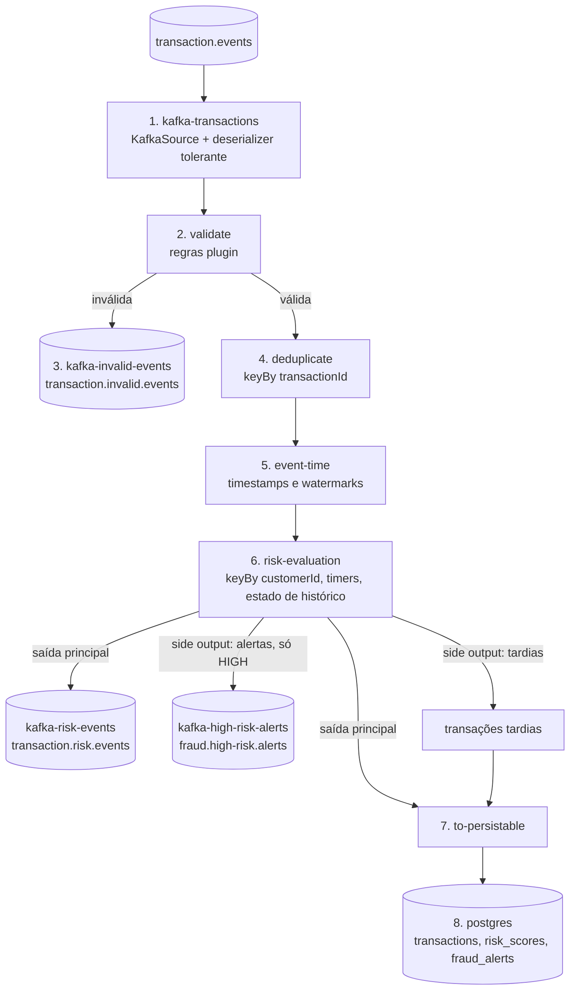

# O pipeline Flink, passo a passo

🇬🇧 English version: [pipeline.md](pipeline.md)

Este documento explica **o que faz cada passo do dataflow, que problema resolve e porque está exatamente onde está**. A
ordem dos passos é definida num único sítio, o `PipelineAssembler`
([código](../flink-job/src/main/java/io/github/jlmc/fraud/bootstrap/PipelineAssembler.java)); os sinks são ligados em
`FraudJob.build` ([código](../flink-job/src/main/java/io/github/jlmc/fraud/bootstrap/FraudJob.java)).

- [1. O fluxo completo](#1-o-fluxo-completo)
- [2. Passo a passo](#2-passo-a-passo)
- [3. Porquê esta ordem](#3-porquê-esta-ordem)
- [4. O estado que o job mantém](#4-o-estado-que-o-job-mantém)
- [5. Métricas por passo](#5-métricas-por-passo)
- [6. Garantias de entrega por fronteira](#6-garantias-de-entrega-por-fronteira)
- [7. O percurso de uma transação: exemplos](#7-o-percurso-de-uma-transação-exemplos)

## 1. O fluxo completo

Guia de leitura: as caixas numeradas de 1 a 8 são os passos do pipeline; os cilindros são tópicos Kafka ou PostgreSQL. Três
dos sinks são alimentados por **side outputs** (inválidas, alertas, tardias): um operador emite vários tipos de resultado
sem ser dividido em vários operadores, que é o padrão recomendado pelo Flink (`OutputTag`).

## 2. Passo a passo

### 1. `kafka-transactions`: ler do Kafka sem nunca rebentar

| | |
|---|---|
| **O que faz** | Um `KafkaSource` lê `transaction.events` e converte cada registo num `IncomingMessage` (transação válida **ou** um erro mais o payload original e o topic/partição/offset). |
| **Problema que resolve** | Receber dados e sobreviver a lixo. Uma única mensagem impossível de ler não pode parar o job. |
| **Porquê assim** | Um deserializer que lança exceção faz o Flink reiniciar, reler o mesmo registo, lançar outra vez e entrar em ciclo (uma *poison message*). O `IncomingMessageDeserializationSchema` nunca lança: JSON inválido, tipos errados, payload vazio ou que não é objeto tornam-se um `IncomingMessage` que transporta o erro. Campos em falta *não* são erro de parsing: a transação é produzida com nulos e são os plugins de validação que decidem. |
| **Offsets** | Começa nos offsets confirmados por uma execução anterior, ou no mais antigo se não houver. Ao restaurar de um checkpoint/savepoint, ganham os offsets guardados pelo próprio Flink (os offsets confirmados no Kafka servem só para monitorizar o lag). Novas partições são descobertas de 30 em 30 s. |
| **Watermarks aqui** | `noWatermarks()`: o tempo de evento é atribuído mais tarde (passo 5), já com os dados limpos. |

### 2. `validate`: rejeitar dados de negócio maus, com regras plugáveis

| | |
|---|---|
| **O que faz** | O `ValidationProcessFunction` corre as regras de validação encontradas por `ServiceLoader` (`validation-rules/*`: montante maior que 0 `AMOUNT_NOT_POSITIVE`, moeda suportada `CURRENCY_NOT_SUPPORTED`, campos obrigatórios `REQUIRED_FIELD_MISSING`). As válidas continuam; tudo o resto vai para o side output `INVALID`. |
| **Problema que resolve** | Lixo nos passos seguintes. As regras de risco e a base de dados assumem uma transação bem formada (montante, cliente e timestamp não nulos); este é o portão que o garante. |
| **Porquê plugins** | Que dados são aceitáveis é uma decisão de negócio que muda mais vezes do que o pipeline. As regras vivem em JARs independentes descobertos no arranque: acrescentar uma regra é acrescentar um JAR, não editar o job (ver [S1](spikes/S1-plugin-classloading.md)). |
| **Porquê primeiro** | É barato e sem estado, por isso remove registos maus antes dos passos caros e com estado, e antes de qualquer shuffle. |
| **Tratamento de falhas** | Os dois tipos de rejeição (payload malformado, violação de regra) tornam-se um `InvalidEvent` com código, mensagem, payload original e coordenadas Kafka, para um registo rejeitado poder ser diagnosticado e reenviado. Nada inválido reinicia o job. |
| **Onde corre** | As regras são carregadas no `open()` no TaskManager (nunca serializadas com o job), com o context classloader. O job falha logo no arranque se não encontrar nenhuma regra. |

### 3. `kafka-invalid-events`: o tópico de dead-letter

| | |
|---|---|
| **O que faz** | Sink do side output `INVALID` para `transaction.invalid.events`, com chave o id da transação. |
| **Problema que resolve** | O input rejeitado não pode desaparecer em silêncio, nem bloquear o fluxo principal. |
| **Porquê AT_LEAST_ONCE** | Um registo de dead-letter duplicado é inofensivo, e as transações Kafka têm custo por registo. O tópico de risco e o de alertas são diferentes: um duplicado aí seria um resultado de negócio duplicado, por isso são EXACTLY_ONCE. |

### 4. `deduplicate`: a mesma transação duas vezes conta uma

| | |
|---|---|
| **O que faz** | `keyBy(transactionId)` e depois `DeduplicationFunction`: a primeira ocorrência passa, as seguintes são descartadas. |
| **Problema que resolve** | Os produtores Kafka repetem envios e os sistemas a montante reenviam. Sem isto, uma transação repetida contaria duas vezes nas regras de velocity e spending e podia levar um cliente a um falso alerta HIGH. |
| **Como** | Um `ValueState<Boolean>` por id de transação ("vista") com **TTL de 24 h**, para o estado ser limitado e não crescer para sempre. |
| **Limites (honestos)** | O TTL mede-se em tempo de *processamento*: um duplicado que chegue mais de 24 h de relógio depois é tratado como novo. A chave primária do PostgreSQL (`ON CONFLICT DO NOTHING`) é a última defesa da base de dados, mas não dos tópicos Kafka. |
| **Porquê outro keyBy** | A deduplicação precisa de todas as cópias de um id na mesma subtask, e o passo de risco precisa de todas as transações de um cliente na mesma subtask. São chaves diferentes, logo há um shuffle extra. É o preço da correção. |

### 5. `event-time`: dizer ao Flink que horas são realmente

| | |
|---|---|
| **O que faz** | `assignTimestampsAndWatermarks` com `forBoundedOutOfOrderness(30 s)` e `withIdleness(30 s)`; o timestamp é o campo `timestamp` da própria transação. |
| **Problema que resolve** | Regras como "mais de 5 transações num minuto" têm de ser sobre *quando a compra aconteceu*, não quando a mensagem chegou. O tempo de processamento daria respostas diferentes para os mesmos dados consoante atrasos, replays e reinícios. |
| **Watermark** | Uma promessa: "já não vai chegar nada anterior a T". `bounded out-of-orderness 30 s` significa que o watermark fica 30 s atrás do evento mais recente, logo eventos até 30 s fora de ordem ainda vão a tempo. |
| **Idleness** | Se uma partição Kafka deixa de receber dados, o seu watermark ficaria parado e travaria o job todo. Após 30 s inativa é ignorada. |
| **Consequência a saber** | O watermark só avança quando chegam eventos mais recentes. Os resultados aparecem por isso cerca de 30 s de *tempo de evento* depois da transação, e as últimas transações de um stream parado esperam até um evento mais novo empurrar o watermark. É também por isso que o `send-transactions.sh` mantém um cursor de tempo de evento. |
| **Porquê depois da dedup** | Um duplicado não deve mover o watermark nem consumir nada; é descartado antes. |

### 6. `risk-evaluation`: o coração do job

`keyBy(customerId)` e depois `RiskEvaluationFunction`. Tudo aqui é *por cliente*, por isso o Flink paraleliza por cliente e
as transações de um cliente são sempre tratadas pela mesma subtask, por ordem.

| | |
|---|---|
| **O que faz** | Pontua cada transação com o histórico recente do cliente e as quatro regras incluídas: |

| Regra (`reason`) | Dispara quando | Score |
|---|---|---|
| `HIGH_TRANSACTION_VELOCITY` | mais de 5 transações em 1 minuto (a atual incluída) | 40 |
| `HIGH_SPENDING_VELOCITY` | mais de 5000 gastos em 10 minutos (a atual incluída; as moedas não são convertidas) | 40 |
| `SUSPICIOUS_COUNTRY_CHANGE` | padrão de países A, B, A em 10 minutos (só códigos de país, sem distância) | 50 |
| `UNUSUAL_AMOUNT` | montante acima de 5 vezes a média recente do cliente, com pelo menos 3 transações passadas | 30 |

Os scores somam-se com teto em 100: abaixo de 40 é `LOW`, de 40 a 69 `MEDIUM`, 70 ou mais `HIGH`. Todos os limiares são
configuráveis (`risk.*`, ver o README).

| | |
|---|---|
| **Problema que resolve** | Transformar um stream de eventos isolados num juízo que depende do comportamento ao longo do tempo. Uma compra de 900 EUR é normal; seis em 25 segundos não. |
| **Resultados independentes da ordem** | Uma transação que chega **não** é avaliada logo. É guardada num buffer por timestamp de evento e regista-se um timer de event time. O timer dispara quando o watermark atinge esse timestamp, isto é, quando (dentro da tolerância de 30 s) já não pode chegar nada mais antigo. Os timers disparam por ordem de timestamp, por isso as transações de cada cliente são avaliadas em ordem de tempo de evento **qualquer que tenha sido a ordem de chegada**. Transações com o mesmo timestamp são ordenadas por id, pelo que um replay dá resultados idênticos. O preço é latência (passo 5). |
| **Eventos tardios** | Uma transação mais antiga que `watermark - allowedLateness` (por omissão 0, ou seja, no watermark ou atrás dele) chega tarde demais para ser avaliada corretamente: **não é pontuada** e vai para o side output `LATE`. Com um allowed lateness diferente de zero seria ainda avaliada, de imediato, contra o histórico que existe nesse momento. |
| **Estado** | Histórico por cliente (lista limitada: no máximo 100 entradas e 1 h, imposto ao acrescentar e por um timer de remoção) e o buffer de transações pendentes. Clientes inativos acabam sem estado. |
| **Alertas** | A mesma avaliação emite, só para resultados HIGH, um `HighRiskFraudAlert` para o side output `ALERTS`. É uma projeção do resultado, não um segundo motor, por isso não pode discordar do tópico de risco. O `alertId` é determinístico (`high-risk-v1-<transactionId>`). Ver [alerts.md](alerts.md). |
| **Porquê este desenho** | A classe Flink **não tem regras de negócio**: só traduz estado por chave, timers, watermark e side outputs em chamadas ao `EvaluateRiskService` e às regras puras do domínio. As regras são por isso testáveis sem Flink, e garantido por ArchUnit. |
| **Porquê regras sequenciais** | Ver [ADR 0004](decisions/0004-sequential-rule-evaluation.md): trabalho puro em memória, o paralelismo já vem da chave, ordem determinística dos `reasons`. |

### 7. `to-persistable`: uma só forma para a base de dados

| | |
|---|---|
| **O que faz** | Converte os resultados pontuados e as transações tardias num único tipo `PersistableEvent` (`PROCESSED` ou `LATE`, o resultado opcional e se é preciso linha de alerta) e une os dois streams. |
| **Problema que resolve** | O sink da base de dados deve receber um só stream de "coisas a guardar", seja a transação pontuada ou tardia. |
| **Porquê** | A decisão da linha de alerta reutiliza a `FraudAlertPolicy`, a mesma política que alimenta o tópico de alertas, por isso a tabela e o tópico concordam sempre sobre o que é um alerta. As tardias são guardadas com estado `LATE` e sem score, para nada se perder em silêncio; **não** são publicadas no tópico de risco. |

### 8. `postgres`: resultados duráveis e consultáveis

| | |
|---|---|
| **O que faz** | Um Sink V2 próprio (`BatchingRepositorySink`) que escreve `transactions`, `risk_scores` e (só HIGH) `fraud_alerts`. |
| **Problema que resolve** | Deixa pessoas e sistemas consultar resultados ("alertas do cliente X"), coisa em que um tópico não é bom. |
| **Batching** | Até 500 eventos ou 200 ms, o que vier primeiro, com flush também antes de cada checkpoint completar: um stream parado não deixa eventos à espera, e tudo o que chegou antes da barreira de checkpoint está durável nesse momento. |
| **Idempotência** | `INSERT ... ON CONFLICT DO NOTHING` na chave primária `transaction_id`. Após uma falha o Flink repete desde o último checkpoint e algumas linhas são escritas de novo; as repetições tornam-se no-ops. |
| **Retries e backpressure** | Erros transitórios são repetidos com backoff exponencial (200 ms até 5 s, no máximo 60 s por lote). Linhas permanentemente más (violações de constraint) distinguem-se de falhas sistémicas (base em baixo, tabela em falta). Se os retries se esgotarem a task falha e o Flink reinicia a partir do checkpoint: não se perdem dados. Enquanto o PostgreSQL está lento o sink bloqueia e o backpressure do Flink abranda a source em vez de esgotar a memória. |
| **Porquê um sink próprio** | O `flink-connector-jdbc` ainda não tem release para Flink 2.x (spike S3). |
| **Garantia** | AT_LEAST_ONCE mais escritas idempotentes: o *resultado* na tabela é exatamente uma vez, mas **não** é exactly-once ponta a ponta (um commit na base e um checkpoint do Flink não se tornam uma só ação atómica sem um sink de two-phase-commit). |

### Os dois sinks de resultados: `kafka-risk-events` e `kafka-high-risk-alerts`

| | |
|---|---|
| **O que faz** | `transaction.risk.events` recebe um registo por transação pontuada, de todos os níveis; `fraud.high-risk.alerts` só os HIGH. Ambos têm chave o cliente, logo os registos de um cliente ficam ordenados dentro de uma partição. |
| **Problema que resolve** | Dois tipos de consumidores: a analítica quer tudo, a equipa de fraude só o que é acionável. |
| **Porquê EXACTLY_ONCE** | Transações Kafka confirmadas quando um checkpoint completa: após um crash, os registos da tentativa falhada são abortados e repetidos, não duplicados. Os consumidores **têm de** usar `isolation.level=read_committed`, e os registos só ficam visíveis após o checkpoint (cerca de 10 s). Cada sink transacional precisa do seu `transactionalIdPrefix`, e o `transaction.timeout.ms` (10 min) tem de exceder o maior checkpoint mais o reinício. |

## 3. Porquê esta ordem

| Restrição | Consequência |
|---|---|
| O lixo não pode chegar aos passos com estado | `validate` é o primeiro e a source nunca lança |
| Um duplicado não pode ser pontuado nem mover o relógio | `deduplicate` está antes de `event-time` e do risco |
| As regras precisam do histórico *do mesmo cliente* por ordem | `keyBy(customerId)` e timers de event time dentro de `risk-evaluation` |
| Os timestamps só são fiáveis depois da validação | `event-time` é atribuído depois de `validate` (a regra de campos obrigatórios rejeita antes um timestamp em falta) |
| Dados tardios não se podem perder em silêncio | side output `LATE`, guardado no PostgreSQL com estado próprio |
| Os sinks não se podem influenciar | Cada sink tem o seu uid, prefixo transacional e comportamento de falha |

Cada operador tem também um `uid` estável. O Flink associa o estado aos operadores pelo uid ao restaurar de um savepoint,
por isso o pipeline pode evoluir sem perder o estado dos operadores que não mudaram.

## 4. O estado que o job mantém

| Operador | Estado | Limitado por |
|---|---|---|
| `deduplicate` | `seen-transaction-id` (booleano por id de transação) | TTL 24 h, limpeza na compactação do RocksDB |
| `risk-evaluation` | `customer-history` (lista por cliente) | retenção 1 h, 100 entradas, timer de remoção |
| `risk-evaluation` | `pending-by-timestamp` (mapa por cliente) | esvaziado pelos timers de event time à medida que o watermark avança |

O estado vive em RocksDB no disco do TaskManager e é guardado incrementalmente em checkpoint no MinIO/S3 de 10 em 10 s (ver
[compose-services.pt.md](compose-services.pt.md)).

## 5. Métricas por passo

| Passo | Contadores (nomes das métricas Flink) |
|---|---|
| `validate` | `transactions_valid`, `transactions_rejected`, `messages_malformed` |
| `deduplicate` | `duplicates_dropped` |
| `risk-evaluation` | `risk_evaluated`, `high_risk_alerts`, `late_events`, `late_events_tolerated` |
| `postgres` | métricas do sink writer e contadores de retry/falha da persistência |

Aparecem na UI do Flink (métricas das tasks) e permitem verificar o balanço: tudo o que foi lido ou foi rejeitado, ou é
duplicado, ou é tardio, ou foi avaliado.

## 6. Garantias de entrega por fronteira

| Fronteira | Garantia | Mecanismo |
|---|---|---|
| Kafka para Flink | sem perda, replay após falha | os offsets são guardados no checkpoint junto com o estado, por isso um restore relê de um ponto consistente |
| Dentro do Flink | estado exactly-once | checkpoints (RocksDB, S3) |
| Flink para tópicos de risco e alertas | exactly-once | sink transacional, consumidores `read_committed` |
| Flink para tópico de inválidas | at-least-once | duplicados tolerados por desenho |
| Flink para PostgreSQL | at-least-once, resultado idempotente | `ON CONFLICT DO NOTHING` |
| Entre sinks | **nenhuma**: três sinks independentes, sem atomicidade entre eles | um registo pode estar visível num sink alguns segundos antes de outro |

## 7. O percurso de uma transação: exemplos

| Entrada | Caminho | Termina em |
|---|---|---|
| Compra válida, 25 EUR, a primeira do cliente | validate (ok) → dedup (nova) → watermark → risk (score 0, LOW) | `transaction.risk.events`; PostgreSQL `transactions` + `risk_scores` |
| Sexta compra de 1000 EUR em 25 s | igual, mas o risco vê velocity (40) e spending (40): score 80, HIGH | tópico de risco **e** `fraud.high-risk.alerts`; PostgreSQL `transactions`, `risk_scores`, `fraud_alerts` |
| Montante 0, ou `{not json` | rejeitada em `validate` | só `transaction.invalid.events` (código `AMOUNT_NOT_POSITIVE` ou `MALFORMED_PAYLOAD`) |
| Mesmo `transactionId` enviado duas vezes | segunda cópia descartada em `deduplicate` | contada em `duplicates_dropped`, mais nada |
| Evento 5 minutos mais antigo que o watermark | não pontuado | PostgreSQL `transactions` com estado `LATE` |
